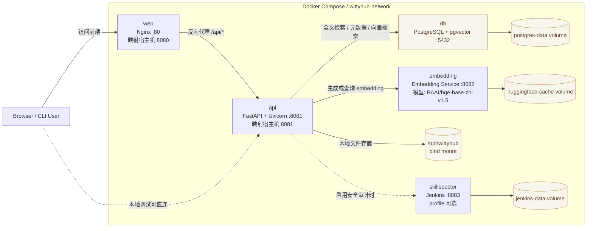
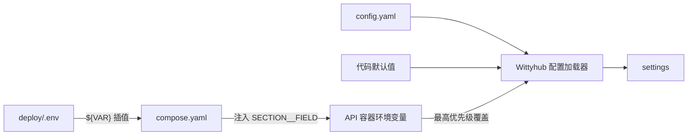

# Wittyhub

AI Agent Skills 检索与分发平台。发现、评估和获取可复用的 AI Agent Skills，支持关键词搜索、分类浏览和安全检测。

## 特性

### 核心功能

- **Skill 发现与搜索** - 支持全文搜索、分类筛选和标签过滤
- **多版本管理** - 支持 Skill 的多个版本和版本历史查看
- **安全检测** - 自动进行安全扫描并生成风险评估报告
- **CLI 工具** - 一键安装 Skills 到本地 `~/.agents/skills/` 目录

### 技术优势

- **高性能** - 基于 FastAPI + Uvicorn，提供异步 API
- **PostgreSQL 全文搜索** - 内置 tsvector，无需额外部署搜索引擎
- **安全可靠** - 支持代码安全扫描、依赖检查和风险信号识别
- **易于部署** - 使用 Docker Compose 快速部署
- **现代化前端** - Vue 3 + TypeScript，支持暗色模式

## 快速开始

### 环境要求

- Docker 与 Docker Compose
- Python 3.10+ 和 uv（本地后端开发）
- Node.js 与 npm（本地前端开发）

### 准备环境变量

```bash
git clone https://gitcode.com/openeuler/wittyhub.git
cd wittyhub
cp deploy/.env.example deploy/.env
```

编辑 `deploy/.env` 时：

- 至少修改 `POSTGRES__PASSWORD`
- 仅启用 `skillspector` profile 时设置 `SECURITY__SKILLSPECTOR_JENKINS_TOKEN`

### 启动开发环境

以下 Docker Compose 命令均在 `deploy/` 目录执行：

```bash
cd deploy
docker compose up --build
```

首次启动后执行数据库迁移：

```bash
docker compose exec api alembic upgrade head
```

### 启动生产环境

生产环境显式指定基础 Compose 文件，避免自动加载开发覆盖配置：

```bash
cd deploy
docker compose -f compose.yaml up -d --build
docker compose -f compose.yaml exec api alembic upgrade head
```

生产模式使用 `deploy/web/nginx.conf`，并将宿主机 443 端口映射到容器 8443。启动前需要准备 Nginx 配置引用的证书文件。

### 访问地址

- 前端：http://localhost:8080
- API：http://localhost:8081
- API 文档：http://localhost:8081/docs

## 架构

默认 Docker Compose 部署由 `web`、`api`、`embedding` 和 `db` 四个服务组成。Jenkins + SkillSpector 安全审计服务通过可选的 `skillspector` profile 启用。

- `web`：提供 Vue 构建产物，并把 `/api/` 请求转发给 `api`
- `api`：提供搜索、详情、版本、分类和安全检测等接口
- `embedding`：为中文语义检索生成向量，供 `api` 调用
- `db`：使用 PostgreSQL + pgvector 保存业务数据和向量列
- `skillspector`：可选的 Jenkins + SkillSpector 安全审计服务



### 数据层能力

- `tsvector`：关键词全文搜索
- `pgvector`：语义向量检索
- `JSONB`：灵活元数据存储
- `ARRAY`：标签等数组字段

## 开发环境

### Docker 运行模式

开发和生产共用 `deploy/compose.yaml`，区别在于是否加载 `deploy/compose.override.yaml`：

| 对比项 | 开发环境 | 生产环境 |
|---|---|---|
| 加载文件 | `compose.yaml` + `compose.override.yaml` | 仅 `compose.yaml` |
| 启动命令 | `docker compose up --build` | `docker compose -f compose.yaml up -d --build` |
| 数据库迁移 | `docker compose exec api alembic upgrade head` | `docker compose -f compose.yaml exec api alembic upgrade head` |
| API 源码 | 挂载宿主机源码 | 使用镜像内源码 |
| Embedding 源码 | 挂载宿主机 `app.py` | 使用镜像内源码 |
| Uvicorn | 启用 `--reload` | 不启用自动重载 |
| Nginx 配置 | `web/nginx.dev.conf` | `web/nginx.conf` |
| 运行方式 | 默认前台运行 | 默认后台运行 |

开发覆盖配置会挂载 `src/`、`scripts/`、`migrations/`、`skillcrawler/`、`skills/` 和 Embedding 源码。修改 Python 源码后通常不需要重新构建镜像。

生成测试数据仅建议用于开发环境：

```bash
cd deploy
docker compose exec api sh -c \
  'python scripts/generate_test_data.py --host "$POSTGRES__HOST" --password "$POSTGRES__PASSWORD"'
```

### 本地运行

只使用 Docker 启动 PostgreSQL：

```bash
cd deploy
docker compose up -d db
cd ..
```

安装 Python 依赖并运行迁移：

```bash
uv venv --python 3.11
source .venv/bin/activate
uv pip install -e ".[dev]"
alembic upgrade head
```

启动后端：

```bash
uvicorn src.api.main:app --reload --port 8081
```

在另一个终端安装前端依赖并启动开发服务器：

```bash
cd web
npm install
npm run dev
```

本地直接运行 Python 时，程序不会自动读取 `deploy/.env`。请在 `config.yaml` 中配置数据库连接，或通过 `POSTGRES__HOST` 等分层环境变量临时覆盖。

## 配置说明

- 完整配置见 `config.yaml`
- 敏感变量模板见 `deploy/.env.example`
- `deploy/.env` 保存数据库凭据和 SkillSpector Token，不应提交到 Git
- `deploy/compose.yaml` 定义服务、端口、网络和挂载，并将 `.env` 中的值映射为容器环境变量

### 配置优先级

配置加载分为 Compose 插值和 Wittyhub 应用加载两个阶段。

Docker Compose 解析 `${VAR}` 时，优先级从高到低为：

```text
当前 Shell 中导出的环境变量
    > deploy/.env
    > compose.yaml 中的 ${VAR:-default} 默认值
```

`.env` 中的变量不会自动全部进入容器。只有被 `compose.yaml` 的 `environment`、`build.args`、`ports` 等位置显式引用的变量才会生效。

Wittyhub API 加载应用配置时，优先级从高到低为：

```text
API 容器中的 SECTION__FIELD 环境变量
    > config.yaml
    > src/core/config.py 中的代码默认值
```

双下划线表示配置段与字段，例如：

| API 容器环境变量 | 覆盖的 `config.yaml` 配置 |
|---|---|
| `POSTGRES__HOST` | `postgres.host` |
| `POSTGRES__USER` | `postgres.user` |
| `POSTGRES__PASSWORD` | `postgres.password` |
| `POSTGRES__DB` | `postgres.db` |
| `SECURITY__SKILLSPECTOR_JENKINS_TOKEN` | `security.skillspector_jenkins_token` |



`storage.local_path` 是运行时数据根目录，默认布局如下：

```text
/opt/wittyhub/
├── skill-repositories/      # 爬虫 clone 的 Skill 仓库
├── download-cache/          # 下载接口生成的 ZIP 缓存
└── logs/                    # skillcrawler 日志
```

## SkillSpector 安全审计

SkillSpector 使用可选的 `skillspector` profile，默认不会启动。仅在启用该 profile 时，需要在 `deploy/.env` 中设置安全的 `SECURITY__SKILLSPECTOR_JENKINS_TOKEN`。功能开关 `security.enable_audit` 由 `config.yaml` 管理。

所有命令均在 `deploy/` 目录执行：

```bash
# 开发环境
docker compose --profile skillspector up --build

# 生产环境
docker compose -f compose.yaml --profile skillspector up -d --build
```

Jenkins 默认通过 http://localhost:8083 访问；API 在 Compose 网络内通过 `http://skillspector:8083` 调用它。Jenkins 部署参数（HTTP 端口、executor 数、quiet period、仓库根目录）统一由 `config.yaml` 的 `security.skillspector_*` 字段管理，容器启动时注入为 `JENKINS_*` / `WITTYHUB_REPOSITORY_ROOT` 环境变量。

## 使用指南

### Web 界面

1. **浏览 Skills**：首页展示热门 Skills 和分类导航，可按分类浏览。
2. **搜索 Skills**：通过关键词搜索，并按分类、平台和标签筛选。
3. **查看详情**：查看版本历史、安全报告和安装命令。

### CLI 工具

```bash
wittyhub search "api framework"
wittyhub show python-api-framework
wittyhub install python-api-framework
wittyhub list
```

### API 调用

```bash
# 获取所有 Skills
curl http://localhost:8081/api/v1/skills/?limit=10

# 搜索 Skills
curl "http://localhost:8081/api/v1/index/search?q=api"

# 获取分类
curl http://localhost:8081/api/v1/index/categories

# 获取 Skill 详情
curl http://localhost:8081/api/v1/skills/python-api-framework

# 获取版本历史
curl http://localhost:8081/api/v1/skills/python/api-framework/versions
```

## 项目结构

```text
wittyhub/
├── src/
│   ├── ai/                 # AI 与向量能力
│   ├── api/                # FastAPI 应用、路由、Schema 和服务
│   ├── core/               # 核心配置
│   ├── indexer/            # 搜索与索引
│   ├── models/             # ORM 模型和数据仓库
│   ├── security/           # 安全审计
│   ├── storage/            # 本地存储与 Skill 打包
│   └── utils/              # 通用工具
├── web/
│   └── src/
│       ├── api/            # 前端 API 客户端
│       ├── assets/         # 图标等静态资源
│       ├── components/     # 通用组件
│       ├── composables/    # Vue 组合式函数
│       ├── pages/          # 页面组件
│       ├── stores/         # Pinia 状态管理
│       └── styles/         # 全局样式
├── migrations/
│   └── versions/           # Alembic 数据库迁移
├── skillcrawler/           # Skill 仓库爬取与同步
├── skills/                 # Skills 引擎相关代码
├── scripts/                # 数据导入和维护脚本
├── tests/                  # 自动化测试
├── deploy/
│   ├── api/                # API 镜像
│   ├── embedding/          # Embedding 服务镜像与应用
│   ├── skillspector/       # SkillSpector/Jenkins 镜像与初始化
│   ├── web/                # Web 镜像与 Nginx 配置
│   ├── compose.yaml        # 基础/生产 Compose 配置
│   └── compose.override.yaml # 开发覆盖配置
├── doc/                    # 项目设计文档
├── config.yaml             # 应用配置
└── pyproject.toml          # Python 项目与工具配置
```

## 开发指南

### 运行测试

```bash
pytest tests/ -v
```

### 代码检查

```bash
ruff check .
mypy src/
```

### 构建前端

```bash
cd web
npm install
npm run build
```

## License

MIT License
