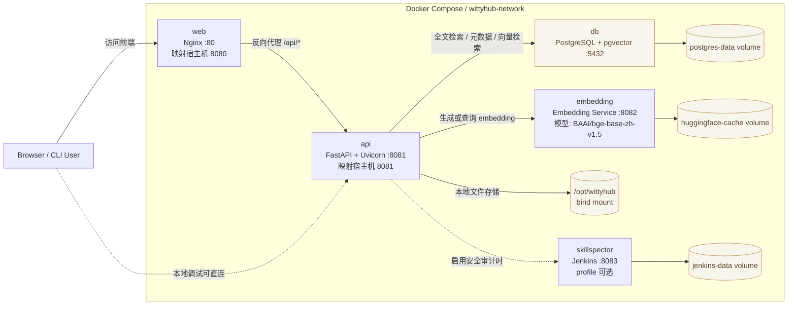
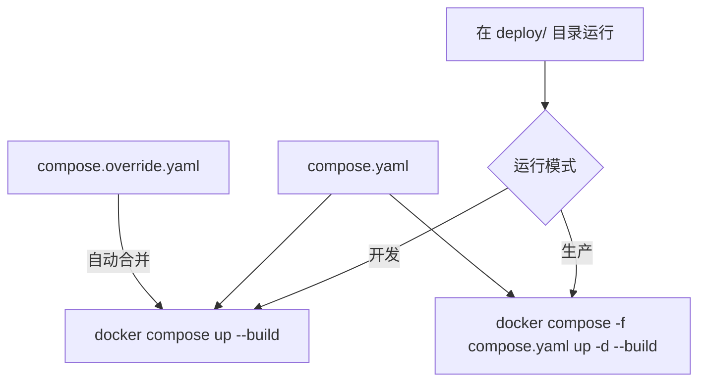
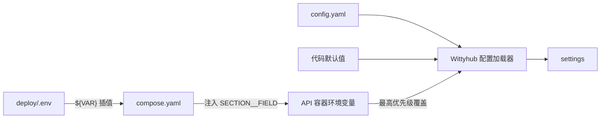

# Wittyhub

AI Agent Skills 检索与分发平台。发现、评估和获取可复用的 AI Agent Skills，支持关键词搜索、分类浏览、安全检测。

## 特性

### 核心功能

- **Skill 发现与搜索** - 支持全文搜索、分类筛选、标签过滤
- **多版本管理** - 支持 Skill 的多个版本，查看版本历史
- **安全检测** - 自动进行安全扫描，生成风险评估报告
- **CLI 工具** - 一键安装 Skills 到本地 `~/.agents/skills/` 目录

### 技术优势

- **高性能** - 基于 FastAPI + Uvicorn，提供异步 API
- **PostgreSQL 全文搜索** - 内置 tsvector，无需额外部署搜索引擎
- **安全可靠** - 代码安全扫描、依赖检查、风险信号识别
- **易于部署** - Docker Compose 一键部署
- **现代化前端** - Vue 3 + TypeScript，支持暗色模式

## 架构
默认 Docker Compose 部署由 4 个服务组成：`web`、`api`、`embedding`、`db`；可通过 `skillspector` profile 启动 Jenkins + SkillSpector 安全审计服务。
- `web`：提供 Vue 构建产物，并把 `/api/` 请求转发给 `api`
- `api`：提供搜索、详情、版本、分类、安全检测等接口
- `embedding`：为中文语义检索生成向量，供 `api` 调用
- `db`：使用 PostgreSQL + pgvector 保存 `skills`、`agents`、`security_audits` 等表，以及 pgvector 向量列
- `skillspector`：可选的 Jenkins + SkillSpector 安全审计服务，通过 Compose profile 启用



### 数据层能力

- `tsvector`：关键词全文搜索
- `pgvector`：语义向量检索
- `JSONB`：灵活元数据存储
- `ARRAY`：标签等数组字段

## 快速开始

### 环境要求

- Docker & Docker Compose
- Python 3.10+ (本地开发) + uv

### Docker 运行模式

开发和生产共用 `compose.yaml`，区别在于是否加载 `compose.override.yaml`：

| 对比项 | 开发环境 | 生产环境 |
|---|---|---|
| 加载文件 | `compose.yaml` + `compose.override.yaml` | 仅 `compose.yaml` |
| API 源码 | 挂载宿主机源码 | 使用镜像内构建好的源码 |
| Embedding 源码 | 挂载宿主机 `app.py` | 使用镜像内构建好的源码 |
| Uvicorn | 启用 `--reload` | 不启用自动重载 |
| 推荐运行方式 | 前台运行，方便看日志 | 后台运行并设置自动重启 |
| 适用场景 | 本地开发和调试 | 服务器部署 |



两种模式都先准备环境变量：

```bash
git clone https://gitcode.com/openeuler/wittyhub.git
cd wittyhub
cp deploy/.env.example deploy/.env
# 编辑 deploy/.env，填写数据库密码和 SkillSpector Token
cd deploy
```

#### 开发环境

在 `deploy/` 目录直接运行时，Docker Compose 会自动合并 `compose.yaml` 和 `compose.override.yaml`：

```bash
docker compose up --build
```

开发覆盖配置会挂载 `src/`、`scripts/`、`migrations/`、`skillcrawler/`、`skills/` 和 Embedding 源码，并为 API 启用 `--reload`。修改 Python 源码后通常不需要重新构建镜像。

如需后台运行开发环境：

```bash
docker compose up -d --build
```

#### 生产环境

生产环境必须显式指定基础文件，避免 Docker Compose 自动加载开发覆盖配置：

```bash
docker compose -f compose.yaml up -d --build
```

生产模式不挂载仓库源码，API 不使用 `--reload`；代码和依赖变更后需要重新构建镜像。

#### 数据库初始化

开发环境：

```bash
docker compose exec api alembic upgrade head
```

生产环境：

```bash
docker compose -f compose.yaml exec api alembic upgrade head
```

生成测试数据仅建议用于开发环境：

```bash
docker compose exec api sh -c \
  'python scripts/generate_test_data.py --host "$POSTGRES__HOST" --password "$POSTGRES__PASSWORD"'
```

#### 访问地址

- 前端: http://localhost:8080
- API: http://localhost:8081
- API 文档: http://localhost:8081/docs

### SkillSpector 安全审计

SkillSpector 使用可选的 `skillspector` profile，默认不会启动。先在 `deploy/.env` 中设置安全的 `SECURITY__SKILLSPECTOR_JENKINS_TOKEN`；功能开关 `security.enable_audit` 统一由 `config.yaml` 管理。

开发环境启动：

```bash
docker compose --profile skillspector up --build
```

生产环境启动：

```bash
docker compose -f compose.yaml --profile skillspector up -d --build
```

Jenkins 默认通过 http://localhost:8083 访问；API 在 Compose 网络内通过 `http://skillspector:8083` 调用它。

### 配置职责

- `deploy/.env`：保存数据库凭据和 SkillSpector Token，不提交到 Git；Compose 只会使用 `compose.yaml` 中通过 `${...}` 引用的变量。
- `config.yaml`：保存模型、搜索、审计开关、日志和存储等应用配置，也是本地直接运行 Python 时的主要配置源。
- `deploy/compose.yaml`：定义服务、固定端口、网络和挂载，并把 `.env` 中的值映射为 API 能识别的 `SECTION__FIELD` 环境变量。

#### 配置优先级

需要分成 Compose 插值和 Wittyhub 应用加载两个阶段理解。

第一阶段，Docker Compose 解析 `${VAR}` 时，优先级从高到低为：

```text
当前 Shell 中导出的环境变量
    > deploy/.env
    > compose.yaml 中的 ${VAR:-default} 默认值
```

`.env` 中的变量不会自动全部进入容器。只有被 `compose.yaml` 的 `environment`、`build.args`、`ports` 等位置显式引用的变量才会生效。Compose 中直接写死的值不受 `.env` 影响，例如：

```yaml
POSTGRES__HOST: db
POSTGRES__PORT: 5432
```

第二阶段，Wittyhub API 加载应用配置时，优先级从高到低为：

```text
API 容器中的 SECTION__FIELD 环境变量
    > config.yaml
    > src/core/config.py 中的代码默认值
```

双下划线表示“配置段与字段”。例如：

| API 容器环境变量 | 覆盖的 `config.yaml` 配置 |
|---|---|
| `POSTGRES__HOST` | `postgres.host` |
| `POSTGRES__USER` | `postgres.user` |
| `POSTGRES__PASSWORD` | `postgres.password` |
| `POSTGRES__DB` | `postgres.db` |
| `SECURITY__SKILLSPECTOR_JENKINS_TOKEN` | `security.skillspector_jenkins_token` |

Docker 部署中的完整链路为：



以数据库为例，Docker 中最终来源是：

| 最终字段 | 来源 |
|---|---|
| `postgres.host`、`postgres.port` | `compose.yaml` 固定的容器网络地址和端口 |
| `postgres.user`、`postgres.password`、`postgres.db` | `deploy/.env`，经 Compose 映射后覆盖 YAML |
| `postgres.sslmode` | `config.yaml`，因为 Compose 没有覆盖它 |

本地不通过 Docker 直接运行 Python 时，程序不会自动读取 `deploy/.env`，因此使用 `config.yaml`；如需临时覆盖，可在 Shell 中设置 `POSTGRES__HOST` 等分层环境变量。

### 本地开发

1. 安装依赖

```bash
uv venv --python 3.11
source .venv/bin/activate
uv pip install -e ".[dev]"
```

2. 配置数据库
编辑 config.yaml 配置数据库连接

3. 运行迁移
这里需要数据库提前运行
```bash
alembic upgrade head
```

4. 启动服务

```bash
# 前端
cd web && npm install && npm run dev

# 后端
uvicorn src.api.main:app --reload --port 8081
```

## 使用指南

### Web 界面

1. **浏览 Skills**
- 首页展示热门 Skills 和分类导航
- 点击分类查看该分类下的所有 Skills

2. **搜索 Skills**
- 使用搜索框输入关键词
- 支持按分类、平台、标签筛选

3. **查看详情**
- 点击 Skill 卡片进入详情页
- 查看版本历史、安全报告、安装命令

### CLI 工具

```bash
# 搜索 Skills
wittyhub search "api framework"

# 查看 Skill 详情
wittyhub show python-api-framework

# 安装 Skill
wittyhub install python-api-framework

# 查看已安装的 Skills
wittyhub list
```

### API 调用

```bash
# 获取所有 Skills
curl http://localhost:8081/api/v1/skills/?limit=10

# 搜索 Skills
curl "http://localhost:8081/api/v1/index/search?q=api"

# 获取分类
curl http://localhost:8081/api/v1/index/categories

# 获取 Skill 详情
curl http://localhost:8081/api/v1/skills/python-api-framework

# 获取版本历史
curl http://localhost:8081/api/v1/skills/python/api-framework/versions
```

## 项目结构

```
wittyhub/
├── src/
│   ├── api/              # FastAPI 应用
│   │   ├── routes/      # API 路由
│   │   ├── models/       # 数据模型
│   │   ├── schemas/      # Pydantic schemas
│   │   └── services/     # 业务逻辑
│   ├── core/             # 核心配置
│   ├── indexer/          # 搜索引擎 (PostgreSQL tsvector)
│   ├── security/         # 安全扫描
│   ├── storage/          # 文件存储
│   ├── migrations/       # 数据库迁移
│   └── utils/            # 工具函数
├── web/                  # Vue 3 前端
│   └── src/
│       ├── components/    # 组件
│       ├── pages/        # 页面
│       ├── api/          # API 客户端
│       └── router/       # 路由配置
├── scripts/              # 脚本
│   └── generate_test_data.py  # 测试数据生成
├── deploy/               # 部署配置
│   └── docker/           # Docker 部署
└── tests/                # 测试
```

## 配置说明

主要配置项 (`config.yaml`):

```yaml
postgres:
  host: localhost
  port: 5432
  user: wittyhub
  password: your_password
  db: wittyhub

storage:
  type: local
  local_path: /opt/wittyhub
  github_token: your_github_token

model:
  name: deepseek-chat
  base_url: https://api.deepseek.com
  api_key: your_deepseek_api_key
  timeout: 30

crawler:
  github_token: your_github_token
  max_tags_per_repo: 3

security:
  enable_audit: true

app:
  host: 0.0.0.0
  port: 8080
  cors_origins:
    - "*"
```

`storage.local_path` 是运行时数据根目录，包含：

```text
/opt/wittyhub/
├── skill-repositories/      # 爬虫 clone 的 Skill 仓库
├── download-cache/          # 下载接口生成的 ZIP 缓存
└── logs/                    # skillcrawler 日志
```

## 开发指南

### 运行测试

```bash
pytest tests/ -v
```

### 代码检查

```bash
ruff check .
mypy src/
```

### 构建前端

```bash
cd web
npm install
npm run build
```

## License

MIT License
