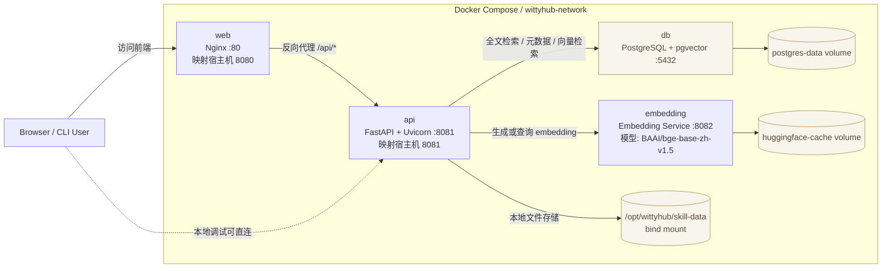

# Wittyhub

AI Agent Skills 检索与分发平台。发现、评估和获取可复用的 AI Agent Skills，支持关键词搜索、分类浏览、安全检测。

## 特性

### 核心功能

- **Skill 发现与搜索** - 支持全文搜索、分类筛选、标签过滤
- **多版本管理** - 支持 Skill 的多个版本，查看版本历史
- **安全检测** - 自动进行安全扫描，生成风险评估报告
- **CLI 工具** - 一键安装 Skills 到本地 `~/.agents/skills/` 目录

### 技术优势

- **高性能** - 基于 FastAPI + Uvicorn，提供异步 API
- **PostgreSQL 全文搜索** - 内置 tsvector，无需额外部署搜索引擎
- **安全可靠** - 代码安全扫描、依赖检查、风险信号识别
- **易于部署** - Docker Compose 一键部署
- **现代化前端** - Vue 3 + TypeScript，支持暗色模式

## 架构
当前 Docker Compose 部署由 4 个服务组成：`web`、`api`、`embedding`、`db`。
- `web`：提供 Vue 构建产物，并把 `/api/` 请求转发给 `api`
- `api`：提供搜索、详情、版本、分类、安全检测等接口
- `embedding`：为中文语义检索生成向量，供 `api` 调用
- `db`：使用 PostgreSQL + pgvector 保存 `skills`、`agents`、`security_audits` 等表，以及 pgvector 向量列



### 数据层能力

- `tsvector`：关键词全文搜索
- `pgvector`：语义向量检索
- `JSONB`：灵活元数据存储
- `ARRAY`：标签等数组字段

## 快速开始

### 环境要求

- Docker & Docker Compose
- Python 3.10+ (本地开发) + uv

### Docker 部署

1. 前端构建

```bash
git clone https://gitcode.com/openeuler/wittyhub.git
cd wittyhub/web
npm install
npm run build
```

2. 启动服务

```bash
cd ../
docker compose -f deploy/docker/docker-compose.yaml up -d
```

3. 初始化数据库

```bash
docker compose -f deploy/docker/docker-compose.yaml exec api alembic upgrade head
```

4. 生成测试数据

```bash
docker compose -f deploy/docker/docker-compose.yaml exec api \
  python scripts/generate_test_data.py --host db --password wittyhub_secret
```

5. 访问服务

- 前端: http://localhost:8080
- API: http://localhost:8081
- API 文档: http://localhost:8081/docs

### 本地开发

1. 安装依赖

```bash
uv venv --python 3.11
source .venv/bin/activate
uv pip install -e ".[dev]"
```

2. 配置数据库
编辑 config.yaml 配置数据库连接

3. 运行迁移
这里需要数据库提前运行
```bash
alembic upgrade head
```

4. 启动服务

```bash
# 前端
cd web && npm install && npm run dev

# 后端
uvicorn src.api.main:app --reload --port 8081
```

## 使用指南

### Web 界面

1. **浏览 Skills**
- 首页展示热门 Skills 和分类导航
- 点击分类查看该分类下的所有 Skills

2. **搜索 Skills**
- 使用搜索框输入关键词
- 支持按分类、平台、标签筛选

3. **查看详情**
- 点击 Skill 卡片进入详情页
- 查看版本历史、安全报告、安装命令

### CLI 工具

```bash
# 搜索 Skills
wittyhub search "api framework"

# 查看 Skill 详情
wittyhub show python-api-framework

# 安装 Skill
wittyhub install python-api-framework

# 查看已安装的 Skills
wittyhub list
```

### API 调用

```bash
# 获取所有 Skills
curl http://localhost:8081/api/v1/skills/?limit=10

# 搜索 Skills
curl "http://localhost:8081/api/v1/index/search?q=api"

# 获取分类
curl http://localhost:8081/api/v1/index/categories

# 获取 Skill 详情
curl http://localhost:8081/api/v1/skills/python-api-framework

# 获取版本历史
curl http://localhost:8081/api/v1/skills/python/api-framework/versions
```

## 项目结构

```
wittyhub/
├── src/
│   ├── api/              # FastAPI 应用
│   │   ├── routes/      # API 路由
│   │   ├── models/       # 数据模型
│   │   ├── schemas/      # Pydantic schemas
│   │   └── services/     # 业务逻辑
│   ├── core/             # 核心配置
│   ├── indexer/          # 搜索引擎 (PostgreSQL tsvector)
│   ├── security/         # 安全扫描
│   ├── storage/          # 文件存储
│   ├── migrations/       # 数据库迁移
│   └── utils/            # 工具函数
├── web/                  # Vue 3 前端
│   └── src/
│       ├── components/    # 组件
│       ├── pages/        # 页面
│       ├── api/          # API 客户端
│       └── router/       # 路由配置
├── scripts/              # 脚本
│   └── generate_test_data.py  # 测试数据生成
├── deploy/               # 部署配置
│   └── docker/           # Docker 部署
└── tests/                # 测试
```

## 配置说明

主要配置项 (`config.yaml`):

```yaml
database:
  host: localhost
  port: 5432
  user: wittyhub
  password: your_password
  dbname: wittyhub

storage:
  type: local
  local_path: /opt/wittyhub/skill-data
  github_token: your_github_token

security:
  enable_audit: true

app:
  host: 0.0.0.0
  port: 8080
  cors_origins:
    - "*"
```

`storage.local_path` 是运行时数据根目录，包含：

```text
/opt/wittyhub/skill-data/
├── skill-repositories/      # 爬虫 clone 的 Skill 仓库
├── download-cache/          # 下载接口生成的 ZIP 缓存
└── logs/                    # skillcrawler 日志
```

## 开发指南

### 运行测试

```bash
pytest tests/ -v
```

### 代码检查

```bash
ruff check .
mypy src/
```

### 构建前端

```bash
cd web
npm install
npm run build
```

## License

MIT License
