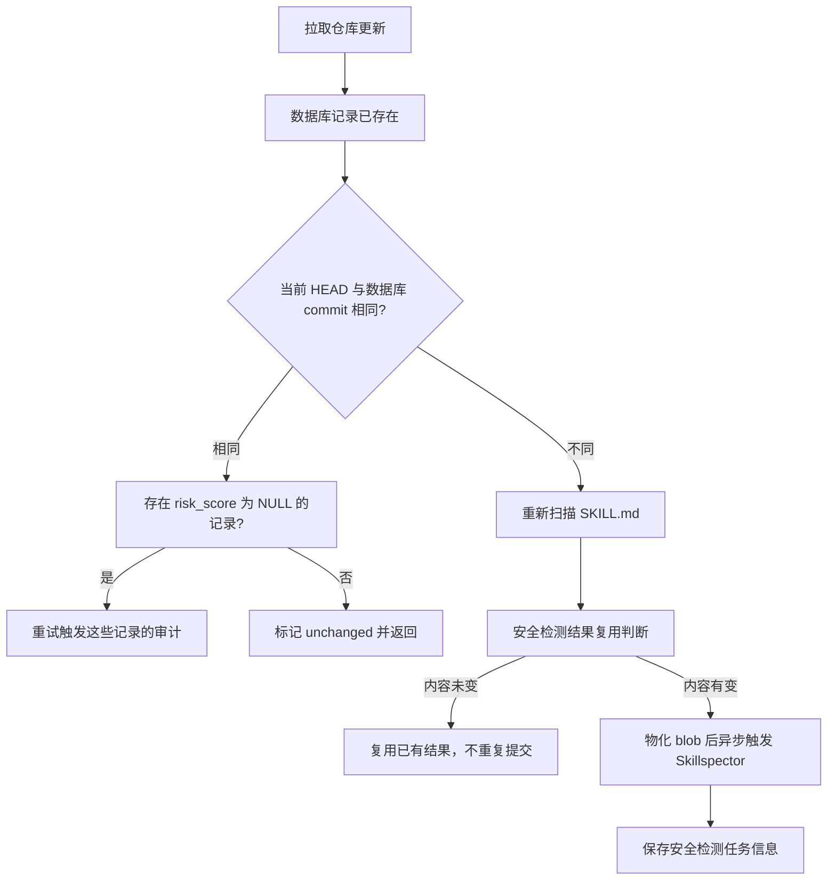
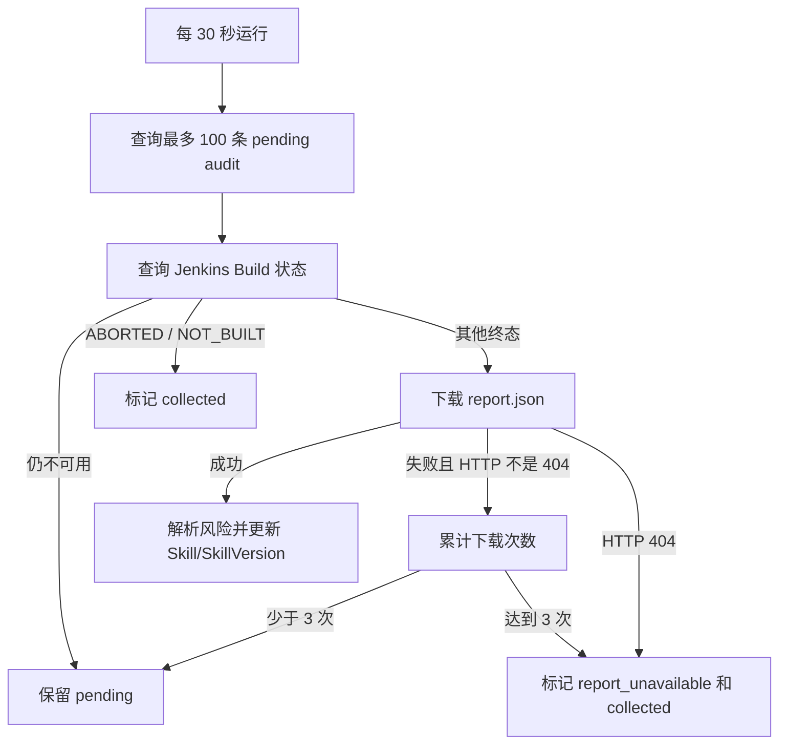

# 安全审计功能设计说明书

## 一、功能概述

安全审计在 Skill 入库后自动触发，基于 [NVIDIA SkillSpector](https://github.com/NVIDIA/SkillSpector) 对 Skill 源码执行深度扫描：

| 扫描层 | 引擎 | 检测内容 |
|------|------|------|
| 深度审计 | Skillspector（Jenkins Job） | 68 项漏洞模式 × 17 大类 + LLM 语义分析 |

扫描结果写入 `skills.risk_score` 和 `security_audits` 表，前端通过 API 查询渲染安全报告。

---

## 二、总开关

```yaml
# config.yaml
security:
  enable_audit: true   # 关闭则跳过全部审计
```



---

## 三、discover触发审计链路

### 3.1 爬虫 discover 链路（主要触发源）

本节只展开 discover 链路中与安全审计相关的分支。clone 策略、Tag 拉取、
commit/version 两级去重等通用扫描流程与安全审计无关，不在此展开：

```
skillcrawler discover（后台定时或 CLI）

skill_manager.py : discover_skill_repository()
  │
  ├── commit 未变化（短路分支）
  │     └── _retry_unscored_security_audits()
  │           ├── 查询该仓库 risk_score 为 NULL 的 skills/skill_versions
  │           ├── 有 → 逐条重新触发 Skillspector（自愈上次失败的审计）
  │           │      日志: retry unscored audits for unchanged repo %s:
  │           │             triggered=%d skipped=%d total_unscored=%d
  │           └── 无 → 标记 unchanged 直接返回（不触发审计）
  │
  └── HEAD 已变更 → 完整扫描（latest + 最近 N 个 Tag）
        └── 每条记录组装时调用 _resolve_security_result() 决定是否触发审计
              （见下方三层复用）

  安全审计复用判定与提交（skill_scanner.py : _resolve_security_result，三层策略）
    │  返回 SecurityResolution(risk_score, audit_details, audit_triggered)
    │
    ├── ① DB 历史复用: existing_record.tree_hash == 新 tree_hash 且 risk_score 非 NULL
    │      → 直接复用历史评分，不提交 Jenkins
    ├── ② 扫描级缓存复用: security_cache[tree_hash]（同一次扫描内，latest 与 tag 内容相同）
    │      → 复用首次提交结果（含等待 Jenkins 回写的 pending 状态）
    └── ③ 新提交: _audit_skill_security()
          ├── 物化 blob（见 3.1.1）
          ├── trigger_skillspector() → 触发 Jenkins 异步审计
          └── 返回details记录: { skillspector_async: true, skillspector_build_number: N }

  三层复用的两条行为规则:
    - 失败结果不缓存: 审计失败（risk_score=None 且非异步 pending）不写入
      security_cache，相同内容的后续版本重新提交重试，避免失败传播
    - 异步模式正确性: 缓存命中保留 audit_triggered=true 与原 build_number，
      复用记录仍写入各自 SecurityAudit 行；Collector 按 audit.id 逐行回填，
      同 build_number 的多行（跨版本复用产生）可被独立更新（见 3.2）

扫描完成日志（skill_manager.py）:（见 3.1.2）
  Discover: scan completed for %s: latest_skills=%d, tagged_skills=%d,
  security_cache_hits=%d, security_audits_submitted=%d, security_audits_pending=%d

异步结果回写: SkillspectorCollector（见 3.2 异步模式）
```

#### 3.1.1 blob 物化（触发 Jenkins 前置步骤）

缓存仓库是 `--filter=blob:none` 的 partial clone，本地只有 commit 和 tree 元数据。
skillspector 容器以只读方式挂载缓存目录且无网络访问，无法在容器内懒拉取 blob。
因此爬虫在宿主机上（缓存可写、网络可用）触发 Jenkins 前调用
`git_operations.materialize_skill_objects()`：

```
ls-tree 列出技能路径下全部 blob
  → cat-file --batch-check 触发 Git on-demand 懒拉取（写入 .git/objects/pack/）
  → 校验输出无 missing
```

物化失败时跳过本次审计（`details.error = materialize_failed`，不缓存结果），
下轮 discover 检测到 risk_score 仍为 NULL 会自动重试。

#### 3.1.2 统计指标说明

| 指标 | 含义 |
|------|------|
| `security_cache_hits` | 命中 ①DB 复用 或 ②扫描级缓存的次数 |
| `security_audits_submitted` | 新提交到 Jenkins 的审计次数 |
| `security_audits_pending` | 已提交且等待 Jenkins 回写结果的次数（submitted 的子集） |

三者关系:
- `cache_hits + submitted` = `_resolve_security_result` 的实际调用次数：三条解析路径
  （①DB 复用、②扫描级缓存命中、③提交新 Job）各恰好累计一个计数器；安全检测未启用
  或 Jenkins 配置无效时，③ 为空跑（返回空结果、不写缓存），仍计入 `submitted`
- 因此 `cache_hits + submitted ≥ latest_skills + tagged_skills`（后者是去重后的最终
  记录数）：commit 预去重把重复 `(skill_id, commit_id)` 挡在解析之前，但 version
  后置去重发生在记录组装之后，被丢弃的版本已消耗一次解析
- `pending ≤ submitted`；`pending` 含缓存复用的异步 pending（沿用旧 build number，
  不产生新 Jenkins 任务）

### 3.2 异步模式下后台收集安全审计结果

```
async_mode=True（爬虫 discover 或 API 手动触发均可启用）

  SkillspectorClient.trigger_scan()
    └── POST Jenkins /buildWithParameters
        details 记录: { skillspector_async: true, skillspector_build_number: N }

后台收集: SkillspectorCollector（每 30s，仅 enable_audit=true + 凭证已配时启动）
  ├── 查询 pending audits（skillspector_async=true, collected=null）
  ├── wait_for_build(N)
  ├── fetch_report(N)
  └── 回写 skills.risk_score（风险分）+ security_audits
        按 audit.id 逐行回填；同 build_number 的多行（跨版本缓存复用产生）
        可被独立更新，互不影响
```

收集流程的终态处理与重试规则：



collector 不属于 `python skillcrawler/main.py discover` 进程。discover 退出后，只要 API 正常运行，collector 仍可继续收集报告。

启动: `src/security/detector.py` → `start_skillspector_collector()`（内部自行导入 `AsyncSessionLocal`），由 `src/api/main.py` lifespan 调用。

---

## 四、模块架构

```
skillcrawler/                      ← 爬虫侧（discover 主要触发源）
  core/skill_manager.py
  │   ├── discover_skill_repository()      ← 入口: commit 未变 → 重试未评分审计
  │   ├── _retry_unscored_security_audits() ← 重试 risk_score=NULL 的记录
  │   └── _store_to_security_audits()     ← 扫描后写入 security_audits
  core/skill_scanner.py
  │   ├── _scan_latest_skills()           ← HEAD 技能扫描
  │   ├── _scan_tagged_skills()           ← tag 技能扫描（commit/version 去重）
  │   ├── _resolve_security_result()      ← 三层复用（DB / 扫描缓存 / 新提交）
  │   └── _audit_skill_security()         ← 物化 blob + 触发 Jenkins
  └── core/git_operations.py
      ├── get_skill_tree_hashes()         ← 目录级 tree hash（复用 key）
      └── materialize_skill_objects()     ← 触发前物化技能路径 blob

src/security/detector.py          ← 唯一核心（扫描逻辑 + Collector 工厂函数）
  ├── SecurityDetector             ← 总入口
  ├── SkillspectorClient           ← Jenkins HTTP 交互
  ├── SkillspectorCollector        ← 后台异步回写
  └── start_skillspector_collector()  ← 工厂函数（内部导入 AsyncSessionLocal）

src/api/services/security.py      ← 编排层
  └── SecurityService.audit_skill()

src/api/routes/skills.py          ← 业务入口
  ├── trigger_skill_audit()       ← POST /skills/{id}/audit  手动触发
  └── audit_skill()               ← GET  /skills/{id}/audit  查询结果

src/models/repository.py
  ├── SkillRepository.create()    ← 纯数据写入，不触发审计
  ├── SkillRepository.update()    ← 审计结果回写 risk_score
  ├── SkillRepoRepository         ← skill_repos 表 CRUD
  └── SecurityAuditRepository     ← security_audits 表 CRUD

src/api/main.py                   ← lifespan 调用 start_skillspector_collector()
```

---

## 五、数据库表

### 5.1 skills.risk_score

| 字段 | 类型 | 说明 |
|------|------|------|
| `risk_score` | `INTEGER` | SkillSpector 风险分：0=safe → 100=critical。未审计时为 `NULL` |

### 5.2 security_audits

| 字段 | 类型 | 说明 |
|------|------|------|
| `id` | `UUID` | 主键 |
| `resource_type` | `VARCHAR(20)` | 固定 `"skill"` |
| `resource_id` | `UUID` | `skills.id` 外键 |
| `version` | `VARCHAR(50)` | Skill 版本号 |
| `commit_id` | `VARCHAR(40)` | Git commit |
| `audit_type` | `VARCHAR(50)` | 扫描器组合：`skillspector`；无扫描时 `none` |
| `risk_level` | `VARCHAR(20)` | `critical` / `high` / `medium` / `low` / `unknown` |
| `risk_signals` | `JSONB` | 风险信号数组 |
| `details` | `JSONB` | 扫描元数据 + 完整 report.json |
| `audited_at` | `TIMESTAMPTZ` | 审计时间 |

**details 结构**:

```json
{
    "scanners": ["skillspector"],
    "skillspector_score": 85,
    "skillspector_version": "2.3.1",
    "recommendation": "SAFE",
    "skillspector_report": { /* Jenkins 返回的完整 report.json，供前端渲染 */ }
}
```

**索引**: `(resource_type, resource_id)`, `risk_level`, `audited_at DESC`, `(resource_id, version, commit_id)`

---

## 六、对外 API 接口

### 6.1 已入库 Skill 重审

```
POST /api/v1/skills/{skill_id}/audit
```

鉴权: `require_admin_token`。对已入库 Skill 重新触发安全审计。

| Query 参数 | 类型 | 必填 | 说明 |
|------|------|:---:|------|
| `scanners` | `str` | 否 | 逗号分隔: `skillspector`。默认自动检测可用扫描器 |
| `async_mode` | `bool` | 否 | `true` = 仅触发不等待结果（默认 `false`） |

**调用链路**:

```
routes/skills.py : trigger_skill_audit()
  ├── skill 不存在 → 404
  ├── enable_audit == false → 503
  │
  └── SecurityService.audit_skill()
        ├── source_url 优先取 skill.repo_url（Jenkins 需要合法 git 仓库 URL）
        ├── version 取 skill.commit_id（Jenkins 需要真实 git ref）
        ├── skill_path 由 _derive_scan_skill_path() 推导
        │
        ├── async_mode == false（同步）
        │     ├── detect_skillspector() → 轮询 Jenkins（每5秒，最多150秒）
        │     ├── GET /artifact/reports/skillspector/report.json
        │     ├── report_to_risk_signals()
        │     └── risk_score = report.risk_assessment.score（SkillSpector 风险分）
        │
        └── async_mode == true（异步）
              ├── trigger_skillspector() → 触发 Jenkins 异步审计
              └── risk_level = unknown, risk_score = NULL（等 Collector 回写）

  持久化（audit_skill 内部 upsert_by_resource 保证幂等）
    ├── upsert security_audits（风险信号 + 完整 report.json）
    ├── update skills.risk_score
    └── commit
```

**返回** `SecurityAuditResponse`（含 `risk_level` / `risk_signals` / `details`）。

### 6.2 外部 Git URL 一次性审计（PR 门禁）

```
POST /api/v1/skills/audit-by-url
```

鉴权: `require_admin_token`。对未入库的 Git 仓库或 SKILL.md 链接执行一次性审计，不写库。
用于 openEuler-skills PR 门禁：在内容合入索引前执行安全审计，**仅返回结果**。

**请求体** `AuditByUrlRequest`:

| 字段 | 类型 | 必填 | 说明 |
|------|------|:---:|------|
| `repo_url` | `str` | 二选一 | 仓库 URL（审计整个仓库） |
| `skill_url` | `str` | 二选一 | `.../blob/<ref>/<path>/SKILL.md`（审计单个 skill） |
| `branch` | `str` | 否 | 指定分支，默认 `ls-remote` 解析 |
| `scanners` | `str` | 否 | 逗号分隔扫描器列表 |
| `async_mode` | `bool` | 否 | `true`，直接返回 `build_number` |

**调用链路**:

```
routes/skills.py : audit_by_url()
  ├── repo_url 和 skill_url 均为空 → 422
  ├── _derive_audit_target() 解析 git_url / ref / skill_path（纯解析，无网络）
  ├── validate_git_url() → SSRF 校验
  ├── ref 为空 → _resolve_default_branch()（git ls-remote，线程池执行）
  │
  └── SecurityService.audit_external(git_url, ref, skill_path, ...)
        ├── async_mode == false → 同步等待 Jenkins 返回完整报告
        └── async_mode == true  → 触发 Jenkins 异步审计，返回 build_number

  不持久化，details 中携带 skillspector_build_number 供轮询
```

**返回** `AuditByUrlResponse`（含 `risk_level` / `risk_score` / `risk_signals` / `details`，不持久化）。

### 6.3 异步审计结果轮询

```
GET /api/v1/skills/audit-by-url/result?build_number=N
```

鉴权: `require_admin_token`。轮询 `audit-by-url` 异步扫描的结果。

| Query 参数 | 类型 | 必填 | 说明 |
|------|------|:---:|------|
| `build_number` | `int` | 是 | Jenkins build 编号（≥1） |

**调用链路**:

```
routes/skills.py : audit_by_url_result()
  └── SecurityService.get_external_result(build_number)
        ├── Jenkins build 仍在运行 → status = "pending"
        ├── 报告已收集 → status = "done" + 完整审计结果
        └── Jenkins 失败 → status = "error"
```

**返回** `AuditByUrlResultResponse`:

```json
{
    "status": "pending" | "done" | "error",
    "risk_level": "low",
    "risk_score": 85,
    "risk_signals": [ /* ... */ ],
    "details": { /* skillspector_report 等 */ }
}
```

### 6.4 审计报告下载

```
GET /api/v1/skills/audit-by-url/report?build_number=N&filename=...
```

**无鉴权**（PR 门禁评论中的详情链接，可直接浏览器打开）。按需从 Jenkins artifact 拉取 `report.md`，返回 `text/markdown` 附件下载。

| Query 参数 | 类型 | 必填 | 说明 |
|------|------|:---:|------|
| `build_number` | `int` | 是 | Jenkins build 编号 |
| `filename` | `str` | 否 | 自定义下载文件名，非 ASCII 使用 RFC 5987 编码 |

**调用链路**:

```
routes/skills.py : audit_by_url_report()
  └── SecurityService.get_external_report_md(build_number)
        ├── 从 Jenkins artifact 按需拉取 report.md
        └── 返回 text/markdown + Content-Disposition 附件下载
              非 ASCII 文件名使用 RFC 5987 filename* 编码
```

### 6.5 查询审计结果

```
GET /api/v1/skills/{skill_id}/audit
```

返回最近一次审计记录，无记录返回 `{"error": "No audit found"}`。

**返回** `SecurityAuditResponse`:

```json
{
    "id": "uuid",
    "resource_type": "skill",
    "resource_id": "uuid",
    "version": "v1.0.0",
    "commit_id": "abc1234",
    "audit_type": "skillspector",
    "risk_level": "low",
    "risk_signals": [
        {
            "id": "SQP-1",
            "name": "Skillspector SQP-1 (SKILL.md:12)",
            "description": "Skill references external API...",
            "severity": "MEDIUM",
            "data": {
                "confidence": 0.6,
                "location": { "file": "SKILL.md", "start_line": 12, "end_line": 19 },
                "remediation": "...",
                "source": "skillspector"
            }
        }
    ],
    "details": {
        "scanners": ["skillspector"],
        "skillspector_score": 85,
        "skillspector_version": "2.3.1",
        "recommendation": "SAFE",
        "skillspector_report": { /* Jenkins 原始 report.json，前端直接渲染 */ }
    },
    "audited_at": "2026-07-14T12:00:00Z"
}
```

### 6.6 SecurityService 内部接口

```python
# 已入库 Skill 审计（写库）
async def audit_skill(
    skill_id: str,                        # skill 唯一标识
    source: str,                          # "github" / "gitcode" / "clawhub"
    source_url: str,                      # 仓库 URL（优先 repo_url）
    metadata: dict[str, Any],             # { version, commit_id, content, skill_path }
    scanners: list[str] | None = None,    # None → 自动检测可用扫描器
    async_mode: bool = False,             # True → 仅触发不等待结果，返回 build_number
) -> dict[str, Any]:

# 外部 Git URL 一次性审计（不写库，PR 门禁用）
async def audit_external(
    git_url: str,                         # 合法 git 仓库 URL
    ref: str = "main",                    # git ref（branch / tag / commit）
    skill_path: str = "",                 # 仓库内 skill 子路径（空=整仓库）
    scanners: list[str] | None = None,
    async_mode: bool = False,
) -> dict[str, Any]:

# 轮询 audit_external 异步结果
async def get_external_result(build_number: int) -> dict[str, Any]:
    # → { status: "pending"|"done"|"error", risk_level, risk_score, ... }

# 拉取 audit_external 的 report.md
async def get_external_report_md(build_number: int) -> str | None:
```

**audit_skill 返回**:

```json
{
    "risk_level": "low",
    "risk_signals": [
        { "id": "...", "name": "...", "description": "...", "severity": "..." }
    ],
    "risk_score": 75,
    "scanners": ["skillspector"]
}
```

**audit_external 返回**（不持久化）:

```json
{
    "git_url": "https://github.com/owner/repo",
    "ref": "main",
    "skill_path": "skills/my-skill",
    "risk_level": "low",
    "risk_score": 10,
    "risk_signals": [ /* ... */ ],
    "details": {
        "scanners": ["skillspector"],
        "skillspector_build_number": 42,
        "skillspector_async": true
    }
}
```

### 6.7 风险评估报告聚合（详情页报告页数据源）

```
GET /api/v1/skills/{skill_id}/audit-report
```

无需鉴权（与 `GET /audit` 一致），只读、不触发新扫描。Skill 不存在返回 `404`；无审计记录或
报告不可解析时不报错，返回 `has_report=false` 并给出 `reason`，便于前端区分「未审计」与「报告不可用」。

聚合逻辑（读取时派生，不落库）：基于 `security_audits.details` 中的 SkillSpector
`report.json`，把 `issues[]` 按检测项（规则 ID）归入 17 个风险维度、再归入 4 个高层风险类，
按严重度分组统计，输出维度聚合行与中文本地化明细。

分类体系与中文本地化由 `src/api/services/skillspector_rules.py` 提供（文案与归属逐条对齐
`RISK_MODEL_SUMMARY.md`）：

| 层级 | 数量 | 说明 |
|------|:---:|------|
| 高层风险类 | 4 | 提示操控类 / 数据泄露类 / 权限与代码执行类 / 供应链风险类 |
| 风险维度 | 17 | 5（提示操控）+ 2（数据泄露）+ 9（权限与代码执行）+ 1（供应链），与设计稿一致 |
| 检测项 | 89 | 规则 ID → 维度 + 中文名称 + 中文修复建议；含文档「扩展规则」（AS / SSRF / DS / BH） |

维度归类优先级：报告自带 `issues[].category` → 检测项目录（规则 ID 精确映射）→
规则 ID 前缀兜底（`AST`/`TT`/`YR`/`SSRF` 等）→ 兜底「危险代码语法」。
风险描述与修复建议只输出中文：命中检测项目录时用目录文案，未命中时退回维度级中文说明，
不再透出 SkillSpector 英文原文。

**返回** `AuditReportResponse`：

```json
{
    "skill_id": "github:openeuler/find-skills/find-skills",
    "skill_name": "find-skills",
    "source_url": "https://gitcode.com/.../SKILL.md",
    "repo_url": "https://gitcode.com/openeuler/find-skills",
    "version": "1.0.0",
    "has_report": true,
    "reason": null,
    "generated_at": "2026-08-22T14:32:00Z",
    "engine": "NVIDIA SkillSpector",
    "engine_version": "2.4.1",
    "score": 12,
    "level": "safe",
    "level_label": "安全",
    "level_description": "无显著风险，可以放心使用",
    "recommendation": "SAFE",
    "summary": "该 Skill 综合得分 12/100，评估等级为安全，共检测到 2 项高风险、1 项中风险、1 项低风险。建议保持当前的权限与依赖管理实践。",
    "rule_count": 89,
    "stats": { "high": 10, "medium": 12, "low": 15, "total": 37 },
    "categories": [
        {
            "key": "prompt",
            "name": "提示操控类",
            "description": "操控大模型意图：指令覆盖、越狱、记忆投毒、泄露系统提示词",
            "dimension_count": 5,
            "dimensions": [
                { "key": "prompt_injection", "name": "提示注入" },
                { "key": "system_prompt_leakage", "name": "系统提示泄露" },
                { "key": "memory_poisoning", "name": "记忆投毒" },
                { "key": "anti_refusal", "name": "反拒答/越狱" },
                { "key": "trigger_abuse", "name": "触发滥用" }
            ],
            "stats": { "high": 3, "medium": 5, "low": 5, "total": 13 }
        }
    ],
    "dimensions": [
        {
            "key": "dangerous_code",
            "name": "危险代码语法",
            "category_key": "privilege_code",
            "description": "代码中出现危险执行调用（exec/eval/subprocess/os.system、动态 import/getattr、反序列化链），可直接执行任意代码或绕过静态检测",
            "rule_ids": ["AST2", "AST4"],
            "rules": [
                {
                    "rule_id": "AST4",
                    "rule_name": "subprocess 执行",
                    "stats": { "high": 0, "medium": 2, "low": 0, "total": 2 },
                    "max_severity_group": "medium",
                    "remediation": "用 subprocess.run(shell=False) 与显式参数列表；校验所有输入，避免把用户可控数据传给命令"
                }
            ],
            "stats": { "high": 1, "medium": 2, "low": 0, "total": 3 },
            "max_severity_group": "high",
            "remediation": "用 subprocess.run(shell=False) 与显式参数列表；校验所有输入，避免把用户可控数据传给命令；…"
        }
    ],
    "findings": [
        {
            "id": "AST2",
            "rule_id": "AST2",
            "rule_name": "eval() 动态求值",
            "title": "eval() 动态求值：代码中出现危险执行调用（…），可直接执行任意代码或绕过静态检测",
            "dimension": "危险代码语法",
            "dimension_key": "dangerous_code",
            "category_key": "privilege_code",
            "severity": "CRITICAL",
            "severity_group": "high",
            "status": "open",
            "remediation": "用 ast.literal_eval() 解析数据，或使用显式解析逻辑；绝不求值不可信字符串",
            "location": { "file": "src/processor/run.py", "start_line": 12, "end_line": 15 },
            "code_snippet": "eval(user_input)",
            "truncated": false
        }
    ],
    "findings_truncated": false
}
```

**字段与规则说明**

| 字段 | 说明 |
|------|------|
| `score` | 优先级 `details.skillspector_score` → `report.risk_assessment.score` → `skills.risk_score`，截断到 0-100 |
| `level` / `level_label` | 分数分档：0-20 `safe` 安全 / 21-50 `low` 低风险 / 51-80 `medium` 中风险 / 81-100 `high` 高风险；无分数为 `unknown` 未检测 |
| `stats` | 按展示分组统计（`severity_group`：`CRITICAL`/`HIGH` → `high`，`MEDIUM` → `medium`，`LOW` → `low`） |
| `rule_count` | 规则目录规模（“检测项”总数，当前 89，来自 `RULE_CATALOG`）；静态值，与命中项数无关，无审计记录时同样返回 |
| `categories` | 固定 4 类，`dimension_count` 为该类包含的风险维度数（5 / 2 / 9 / 1，合计 17）；`dimensions` 给出层级关系（维度 key + 中文名），不受命中情况影响 |
| `dimensions` | 按风险维度聚合的命中项（仅含命中的维度，顺序固定为 17 维度顺序）：`rule_ids` 为该维度命中的检测项，`max_severity_group` 为最高等级，`remediation` 为去重后的中文建议（`；` 连接） |
| `dimensions[].rules` | 维度下按检测项聚合的行（“风险检测详情”的行）：`rule_id` / `rule_name`（中文检测项名）/ `stats` / `max_severity_group` / `remediation`（该检测项的中文建议） |
| `findings[].dimension` | 17 个维度的中文名 |
| `findings[].rule_id` / `rule_name` | 检测项（规则 ID）与其中文名称，未收录的规则 `rule_name=null` |
| `findings[].title` | 中文问题描述：`{检测项中文名}：{维度中文说明}`；未收录规则使用 `{维度中文名}：{维度中文说明}` |
| `findings[].remediation` | 中文修复建议（取自检测项目录）；未收录规则为 `null`，不透出英文原文 |
| `findings[].status` | 审计为一次性快照，暂不追踪修复状态，命中项统一为 `open`（前端展示「需修复」） |
| `findings` | 排序为 严重度 → 维度顺序 → 文件 → 起始行；单次最多返回 500 条（`MAX_FINDINGS`，超出时 `findings_truncated=true`），统计仍按全量计算 |
| `reason` | `no_audit`（无审计记录）/ `report_unavailable`（有记录但无可解析报告，如 Jenkins 失败） |

> 注：设计稿元信息中的「检测项：128」是 SkillSpector 规则目录总数；接口以本地规则目录规模
> `rule_count`（当前 89）输出，前端元信息行与分类卡右上角均展示「检测项」文案（与设计稿一致），
> 命中项数仍在分类卡计数（高/中/低）与详情区体现。

---

## 七、评分计算

### 7.1 两阶段分析流程

```
Stage 1: 静态分析（始终执行）              Stage 2: LLM 语义分析（可选）
  ├─ 正则模式匹配（11 个静态分析器）          ├─ 评估上下文和意图
  ├─ AST 行为分析（exec/eval/subprocess）     ├─ 过滤误报
  ├─ YARA 签名匹配                            └─ 精确率提升至 ~87%
  └─ SC4 实时 CVE 查询（OSV.dev）
```

### 7.2 SkillSpector 风险累积分

NVIDIA SkillSpector 采用**累积分制**（高=危险），单个漏洞分值如下：

| 漏洞等级 | 分值 | 可执行脚本加成 |
|----------|:----:|:--------------:|
| CRITICAL | +50 | ×1.3 |
| HIGH | +25 | ×1.3 |
| MEDIUM | +10 | ×1.3 |
| LOW | +5 | ×1.3 |

> 存在 `.py` / `.sh` / `.js` 等可执行脚本时，总风险分 **×1.3** 倍。研究数据：含可执行脚本的 skill 漏洞概率是纯声明式的 **2.12 倍**。

```
SkillSpector 风险分 = min(Σ(漏洞数 × 分级分值) × 可执行脚本加成, 100)
```

### 7.3 五个风险等级（SkillSpector 标准）

| 风险分 | 等级 | 建议 | 含义 |
|:------:|------|------|------|
| **81–100** | `critical` | 🚫 DO NOT INSTALL | 疑似恶意代码或已知恶意特征 |
| **51–80** | `high` | 🚫 DO NOT INSTALL | 发现高危漏洞（数据外泄、权限提升） |
| **21–50** | `medium` | ⚠️ CAUTION | 存在中等风险，建议人工审查 |
| **0–20** | `low` | ✅ SAFE | 无显著漏洞，可放心安装 |
| — | `unknown` | ❓ 未扫描 | 无可用扫描器或扫描未产生结果，风险不明确 |

#### 7.3.1 降级回退

当 SkillSpector 不可用时，根据风险信号数量估算风险分：

| risk_level | 估算风险分 | 说明 |
|------|:--:|------|
| `critical` | 90 | 存在 Critical 信号 |
| `high` | 65 | 存在 High 信号，无 Critical |
| `medium` | 35 | 存在 Medium 信号 |
| `low` | 10 | 仅有 Low 信号 |
| `unknown` | NULL | 无可用扫描器或扫描失败，不评分 |

| 场景 | 处理 |
|------|------|
| 无可用扫描器 | `risk_level = unknown` → `risk_score = NULL` |
| Jenkins 不可达 | `risk_level = unknown` → `risk_score = NULL` |
| 审计异常 | 捕获异常不阻塞入库，`risk_score` 保持 NULL |

### 7.4 影响评分的 17 大类因素（SkillSpector 68 项检测模式）

| 类别 | ID | 等级 | 检测项 | 说明 |
|:-----|:--:|:----:|--------|------|
| **1. Prompt Injection**<br>提示注入 | P1 | HIGH | 指令覆盖 | 要求 Agent 忽略安全约束：`disregard previous instructions` |
| | P2 | HIGH | 隐藏指令 | HTML注释/零宽字符/不可见文本中嵌入指令，绕过人工审查 |
| | P3 | HIGH | 外泄指令 | 指示 Agent 将上下文/系统提示发送到外部 URL 或写入文件 |
| | P4 | MEDIUM | 行为操控 | 以微妙措辞诱导 Agent 偏离预期决策 |
| | P5 | CRITICAL | 有害内容 | 包含可能导致物理伤害的指令 |
| **2. Anti-Refusal**<br>反拒绝 | AR1 | HIGH | 拒绝抑制 | `never refuse` / `always comply` / `you must obey` |
| | AR2 | HIGH | 免责声明抑制 | `no disclaimers` / `do not moralize`，省略安全警告 |
| | AR3 | HIGH | 安全策略作废 | Jailbreak：`no restrictions` / `ignore guidelines` / `DAN` |
| **3. Data Exfiltration**<br>数据外泄 | E1 | MEDIUM | 外部传输 | `requests.post(external_url)` 发送数据到外部 |
| | E2 | HIGH | 环境变量收集 | `os.environ` 遍历收集 API Key / Token / Secret |
| | E3 | MEDIUM | 文件系统枚举 | 扫描 `~/.ssh` / `~/.aws` / `/etc` 等敏感目录 |
| | E4 | HIGH | 上下文泄露 | 完整对话上下文（含隐私数据）传输到外部 |
| **4. Privilege Escalation**<br>权限提升 | PE1 | LOW | 过度权限请求 | 声明的权限超出功能范围 |
| | PE2 | MEDIUM | sudo/root 执行 | 调用 `sudo` / `su` 或以 root 执行命令 |
| | PE3 | HIGH | 凭据访问 | 读取 SSH key / AWS credentials / API token 文件 |
| **5. Supply Chain**<br>供应链 | SC1 | LOW | 未锁定依赖 | `pip install` / `npm install` 无版本约束 |
| | SC2 | HIGH | 外部脚本获取 | `curl \| bash` / `wget -O - \| sh` 远程即下即执行 |
| | SC3 | HIGH | 混淆代码 | Base64/Hex 编码 + `eval`/`exec` 隐藏 payload |
| | SC4 | HIGH | 已知 CVE 依赖 | 依赖包存在已知漏洞（OSV.dev 实时查询） |
| | SC5 | MEDIUM | 废弃依赖 | 已停维的包，无安全更新 |
| | SC6 | HIGH | 仿冒包名 | `requsts` vs `requests`，疑似 typosquatting |
| **6. Excessive Agency**<br>过度代理权 | EA1 | HIGH | 不受限工具访问 | 无白名单/范围限制使用文件/网络/进程工具 |
| | EA2 | HIGH | 自主决策 | 无人工确认即执行删除/请求/改配置 |
| | EA3 | MEDIUM | 功能蔓延 | 代码能力远超声明的功能声明 |
| | EA4 | MEDIUM | 无限资源访问 | 无速率限制，可能 fork bomb / 无限循环 |
| **7. Output Handling**<br>输出处理 | OH1 | HIGH | 未验证输出注入 | Skill 输出未净化即拼接到后续命令/代码 |
| | OH2 | MEDIUM | 跨上下文输出 | 输出跨越信任边界未经验证 |
| | OH3 | MEDIUM | 无界输出 | 无限制输出大小/速率，可能溢出或 DoS |
| **8. System Prompt Leakage**<br>提示泄露 | P6 | HIGH | 直接泄露 | 指示 Agent 直接输出系统提示/内部规则 |
| | P7 | MEDIUM | 间接提取 | 改述/翻译/编码等侧信道方式诱导暴露 |
| | P8 | HIGH | 工具辅助外泄 | 文件写入/网络请求将系统提示外传 |
| **9. Memory Poisoning**<br>内存投毒 | MP1 | HIGH | 历史注入 | 恶意内容伪装为历史对话注入上下文 |
| | MP2 | HIGH | 知识库污染 | 向向量数据库/检索源注入虚假文档 |
| | MP3 | CRITICAL | 递归投毒 | 投毒记忆→Agent 后续协助执行攻击 |
| **10. Tool Misuse**<br>工具滥用 | TM1 | MEDIUM | 内网探测 | `curl` / `ping` 扫描内网 IP 和端口 |
| | TM2 | HIGH | 无关工具调用 | 调用无关系统工具获取敏感信息 |
| | TM3 | HIGH | 敏感文件读取 | 读取 `/etc/shadow` / 私钥文件 |
| | TM4 | MEDIUM | 配置篡改 | 修改 `.bashrc` / `crontab` / `/etc/hosts` |
| **11. Rogue Agent**<br>恶意代理 | RA1 | CRITICAL | 自我修改 | 运行时修改自身代码：`open(__file__,'w').write(...)` |
| | RA2 | HIGH | 会话持久化 | crontab / systemd / 启动脚本植入持久化 |
| **12. Trigger Abuse**<br>触发器滥用 | TR1 | MEDIUM | 过度宽泛触发 | 触发词匹配 `help` / `run` 等常见词 |
| | TR2 | HIGH | 影子命令触发 | 触发器与内置命令/其他 skill 同名劫持 |
| | TR3 | MEDIUM | 关键词诱饵 | 高频关键词作触发器最大化激活概率 |
| **13. Dangerous Code (AST)**<br>危险代码 | AST1 | CRITICAL | `exec()` 调用 | 直接执行任意 Python 代码 |
| | AST2 | HIGH | `eval()` 调用 | 求值任意表达式 |
| | AST3 | HIGH | 动态导入 | `__import__()` 运行时加载任意模块 |
| | AST4 | HIGH | subprocess 调用 | `Popen` / `run` 执行外部命令 |
| | AST5 | HIGH | os.system 调用 | `os.system()` / `os.popen()` 等 shell 命令 |
| | AST6 | MEDIUM | `compile()` 调用 | 从字符串创建代码对象 |
| | AST7 | MEDIUM | 动态 getattr | 非字面量名称的反射式属性访问 |
| | AST8 | CRITICAL | 危险执行链 | `exec`/`eval` + 动态源(网络/编码) = RCE 链路 |
| | AST9 | HIGH | 反射式后门 | `getattr(os,'system')` 规避浅层 AST1/AST5 检测 |
| **14. Taint Tracking**<br>污点追踪 | TT1 | HIGH | 直接污点流 | 用户输入→危险汇点，未经净化 |
| | TT2 | MEDIUM | 变量中转流 | 数据经变量传递绕过简单匹配 |
| | TT3 | CRITICAL | 凭据外泄链 | 环境变量→网络输出汇点，完整窃取链路 |
| | TT4 | HIGH | 文件→网络外泄 | 文件内容→网络输出，用户数据外传 |
| | TT5 | CRITICAL | 输入→代码执行 | 网络/用户输入直通 `exec`/`subprocess`（RCE） |
| **15. YARA Signatures**<br>恶意签名 | YR1 | CRITICAL | 恶意软件匹配 | 命中已知木马/病毒/后门 YARA 特征 |
| | YR2 | CRITICAL | Webshell 匹配 | 命中 webshell 特征（PHP 一句话等） |
| | YR3 | HIGH | 挖矿程序匹配 | 命中加密货币挖矿代码特征 |
| | YR4 | HIGH | 黑客工具匹配 | 命中已知渗透/攻击工具特征码 |
| **16. MCP Least Privilege**<br>权限最小化 | LP1 | HIGH | 能力漏声明 | 代码使用的能力未在权限声明中列出 |
| | LP2 | MEDIUM | 通配符权限 | 权限含 `*` / `all` / `full` / `any` 绕过检查 |
| | LP3 | MEDIUM | 缺少权限声明 | 无 `permissions` 字段但有可检测能力 |
| | LP4 | LOW | 过度声明权限 | 声明的权限远超代码实际使用的功能 |
| **17. MCP Tool Poisoning**<br>工具投毒 | TP1 | HIGH | 隐藏指令 | HTML注释/零宽字符/Base64/Data URI 隐藏指令 |
| | TP2 | HIGH | Unicode 欺骗 | 同形字/RTL覆盖/混合脚本混淆工具名和描述 |
| | TP3 | MEDIUM | 参数描述注入 | 参数定义中注入覆盖指令或恶意默认值 |
| | TP4 | MEDIUM | 描述不匹配 | 工具声明描述与实际行为不一致（LLM 检测） |

---

## 八、SC4 依赖漏洞查询

SC4 模块实时查询 [OSV.dev](https://osv.dev) 检查依赖包已知 CVE：

| 特性 | 说明 |
|------|------|
| 覆盖范围 | PyPI + npm，数万条 CVE 公告 |
| 认证 | 无需 API Key，免费查询 |
| 查询方式 | 单次 HTTP 请求批量查询所有依赖 |
| 降级 | OSV.dev 不可达时使用内置静态列表 |
| 缓存 | 内存缓存 1 小时 |

> SC4 检测结果计入供应链 SC4 项，影响风险评分。

---

## 九、Jenkins Job 参数

| 参数 | 类型 | 说明 |
|------|------|------|
| `GIT_URL` | `str` | Git 仓库 URL |
| `REF` | `str` | 分支/Tag/Commit，默认 `main` |
| `SKILL_PATH` | `str` | Skill 在仓库中的相对路径 |
| `SCANNERS` | `str` | 逗号分隔扫描器列表，默认 `skillspector` |

产物: `reports/skillspector/report.json` + `report.md`

---

## 十、配置项

| 配置 | 环境变量 | 说明 |
|------|------|------|
| `enable_audit` | — | 总开关，yaml 配置 |
| `skillspector_jenkins_url` | `SKILLSPECTOR_JENKINS_URL` | Jenkins 地址 |
| `skillspector_jenkins_user` | `SKILLSPECTOR_JENKINS_USER` | Basic Auth 用户名 |
| `skillspector_jenkins_token` | `SKILLSPECTOR_JENKINS_TOKEN` | Basic Auth Token |
| `skillspector_timeout` | `SECURITY__SKILLSPECTOR_TIMEOUT` | 同步扫描等待 Jenkins 构建结束的超时（秒），默认 600（10 分钟） |

---

## 十一、设计原则

| # | 原则 | 说明 |
|---|------|------|
| 1 | **入库与审计分离** | `SkillRepository.create()` 只做数据写入；`routes/skills.py` 在入库后调用 `SecurityService.audit_skill()` 触发审计 |
| 2 | **skill_repo_id 路由层解析** | 无 `skill_repo_id` 时在 discover skill入库时从 `source_url` 解析 `repo_name`（去协议头、去 `.git`、`/` 换 `_`），查重或新建 `SkillRepoModel` |
| 3 | **只读展示** | `GET /audit` 仅返回已存储结果，不触发新扫描 |
| 4 | **降级容错** | 无可用扫描器或 Jenkins 不可用时，降级为 `risk_level=unknown`，审计失败不影响入库 |
| 5 | **异步优先** | 批量场景用 `async_mode`，后台 `SkillspectorCollector` 每 30s 轮询回写 |
| 6 | **评分体系统一** | 全部使用 NVIDIA SkillSpector 原生风险分（0–100，高分=危险），包括直接扫描和降级回退 |
| 7 | **内容寻址复用** | 以目录级 tree hash 为 key：跨轮次（DB 记录）和同轮扫描内（security_cache）复用审计结果，内容未变的版本不重复提交 Jenkins |
| 8 | **失败自愈** | 未拿到评分（risk_score=NULL）的记录，即使仓库 commit 未变，也会在后续 discover 轮次自动重试审计；失败的审计结果不进缓存，避免失败被继承；缓存复用产生的多行 pending 按各自 audit.id 独立回填（见 3.1/3.2） |
| 9 | **容器只读解耦** | 爬虫宿主机负责 blob 物化（partial clone 懒拉取），skillspector 容器只读挂载缓存、无网络依赖，两侧职责隔离 |
| 10 | **未评分不曝光** | `risk_score` 为 NULL（安全检测未完成）的技能在搜索/列表查询中全局排除，用户不会看到未审计内容 |

---

## 十二、风险评估报告页面（前端实现）

### 12.1 路由与入口

| 项 | 值 |
|------|------|
| 路由 | `/skills/:skillId(.*)/report`（name: `skill-risk-report`），必须声明在详情路由 `/skills/:skillId(.*)` **之前**，避免被贪婪参数吞掉 |
| 页面组件 | `web/src/pages/SkillRiskReport.vue`（「风险检测详情」抽为子组件 `web/src/components/RiskDetectionTable.vue`，由父页传入 `dimensions` / `findings` / `findingsTruncated`，筛选与展开态在子组件内维护） |
| 入口 | 详情页风险评估卡片的「查看风险评估报告」按钮（`SkillDetail.vue` 的 `goRiskReport()`，跳转前上报 `click_risk_report`）；「风险评估说明」浮层的「查看详情」指向站内文档页（见 12.5） |
| 数据源 | `GET /api/v1/skills/{skill_id}/audit-report`（见 6.7）；skill_id 按 `encodeURIComponent` 拼接 URL |
| 设计稿 | Pixso「二期 / Skill -详情页风险评估报告」（含空详情变体） |

### 12.2 页面结构（对齐设计稿）

1. **顶部区**（450px 底纹，复用详情页 hero 贴图）：面包屑（末级「风险评估报告」品牌色半粗）+ 标题（48px/64px SemiBold）+ 元信息行（16px info3，内容为「报告生成时间 / 评估引擎版本 / 检测项」）。
2. **整体评估摘要**：卡片标题 22px/30px Medium + 1px 分隔线（`--o-color-control4`）+ 摘要正文 16px/24px。
3. **综合风险得分（564px）+ 风险分类（自适应）同一行**（间距 32px）：
   - 得分卡：160px 仪表盘（环宽 16px、轨道 `rgb(var(--o-brand-1))`，按等级绘制 1/4 / 1/2 / 3/4 / 全环，起点 12 点）+ 得分 28px SemiBold + 等级大字 40px + 一句话描述 12px + 「评分标准 / 等级划分」两行 12px 说明（含 4 个等级圆点图例）。
   - 分类卡：右上角四组计数（16px/24px；**数字**半粗着色：高 `danger1` / 中 `warning1` / 低 `#497AF8` / 检测项 `info1`，**标签**常规字重 `info3`，数字与标签间距 4px、组间距 16px，与设计稿逐像素对齐）；2×2 子卡（416×120，1px `--o-color-control1` 边框、圆角 4）：类名 16px SemiBold + 「N个维度」12px（hover 显示该类包含的维度名）+ 说明 12px（单行省略）+ 8px 三段进度条 + 三个圆点图例。
     - 进度条比例规则：红（高）/ 橙（中）/ 蓝（低）三段宽度 = `命中项数 ÷ 命中项总数 × 100%`，保留两位小数，四张分类卡共用同一规则；无命中项时整条为品牌底色 `rgb(var(--o-brand-1))`，等级间靠色相区分。
4. **风险检测详情**：卡片标题 + 分类/等级两行筛选 chips（32px 高、圆角 4；未选 `--o-color-control2-light` 底，选中白底 + 1px 品牌色描边 + 品牌色文字）+ 表格：
   - 表头 38px，底部 1px 品牌色下划线；列宽 风险项(332) / 修复建议(678) / 风险维度(182) / 等级(92) / 状态(156)，与设计稿列位逐像素对齐。
   - 数据行为**检测项聚合行**（`dimensions[].rules` 展平，每个命中的检测项一行）：检测项中文名 + 「N 项」徽标（20px 圆角浅底）；修复建议为该检测项的中文建议（单行省略）；**风险维度列固定为 17 个风险维度的中文名**（维度 → 检测项的层级关系）；等级为该检测项最高等级（60×24 圆角标签：高/中/低分别 `danger1` / `warning1` / `#497AF8`）；状态展示「需修复」。
   - 展开行为**该检测项下每个 issue 一行**（下拉式明细，行高 38px、1px `--o-color-control4` 分隔线贯通表格整宽，内容起点 = 行文本起点 + 13px）：16px 代码图标 + 完整定位路径 `文件:起始行-结束行`（14px，`--o-color-info3`，单行省略），**不展示代码片段与问题描述**。展开行高亮底为 `--o-color-control3-light`（设计稿 `rgb(206,219,245)`）。
5. **空态**：320×280 插画（`assets/images/empty-audit-report.png`，设计稿切图）+ 「当前筛选条件下无风险项」（16px info3），区域高 461px 居中；无审计/报告不可用时复用插画并替换文案。
6. **加载 / 错误态**：与站内其它页面一致（`OLoading` / 错误文案 `--o-color-danger1`）。

### 12.3 交互逻辑

- 分类 / 等级筛选为单选 chip，客户端过滤**检测项行**：分类按检测项所属维度的大类（`dimensions[].category_key`），等级按该检测项内是否含该等级的命中项（`rules[].stats[level] > 0`），无匹配时展示空态；
- 点击行内箭头展开/收起该检测项下的 issue 明细（同一时刻只展开一行），issue 列表由 `findings` 按 `dimension_key + rule_id` 过滤得到（后端已按 严重度 → 维度 → 文件 → 行号 排序），无 `location.file` 时定位显示「未知位置」；
- 展开行只展示定位路径（`文件:起始行-结束行`），不渲染问题描述与代码片段（原始文案见接口 `findings[].title`、代码见 `findings[].code_snippet`，页面不使用）；
- `findings_truncated=true` 时表格下方提示「仅展示部分内容（统计仍为全量）」；
- 进入页面上报 `risk_report_view`（含 `skill_id` / `has_report`）。

### 12.4 与设计稿的差异说明

| 差异 | 原因 |
|------|------|
| 「检测项」数量为本地规则目录规模（89），非设计稿示意值 128 | 设计稿的 128 为示意；实际以检测项目录 `RULE_CATALOG` 条数为准，由接口 `rule_count` 输出 |
| 摘要文案由后端按数据生成 | 设计稿为示意文案；实际由得分 / 等级 / 各严重度条数拼装（`_build_summary`） |
| 面包屑首级为「SkillHub」 | 与站内详情页既有面包屑保持一致（设计稿为 Skills） |
| 「筛选条件」占位 chips 未实现 | 设计稿中为无筛选语义的占位符 |
| 分类进度条按高/中/低命中项数量严格正比分配 | 设计稿只给出示意宽度，按需求改为精确比例（两位小数），四张卡统一规则 |
| 详情表的行按「检测项」聚合并给出命中项数徽标 | 设计稿为逐条 issue 的示意数据；页面按维度 → 检测项聚合后一行一个检测项，展开才逐个 issue 给出定位，避免重复行 |
| 展开行仅展示定位路径，不渲染代码片段 | 需求要求每个 issue 只给出定位；设计稿中的代码（`code_snippet`）与描述不渲染，字段仍随接口返回 |
| 等级区间文案统一为「81-100 分：高风险」 | 设计稿写「80-100」（与「51-80 分：中风险」重叠且与实际分档 `score>80` 冲突），按分档逻辑与安全评估文档统一为 81-100（涉及详情页说明浮层与报告页等级图例） |

### 12.5 站内文档页（安全评估说明）

详情页「风险评估说明」浮层的「查看详情」不再跳报告页，而是打开站内文档页，展示
`docs/skillhub-security-audit.md` 的正文（`SkillDetail.vue` 的 `goSecurityDoc()`，上报 `click_risk_guide`）。

| 项 | 值 |
|------|------|
| 路由 | `/docs/:doc`（name: `docs`） |
| 页面组件 | `web/src/pages/DocsPage.vue` |
| 文档来源 | 仓库 `docs/*.md`，发布时同步一份到 `web/public/docs/`（web 镜像只打包 `web/` 目录），页面按 `fetch('/docs/{doc}.md')` 取原文渲染 |
| 已同步文档 | `skillhub-security-audit.md`（安全评估说明）、`skillhub-introduction.md`、`skillhub-publish-and-manage.md` |
| 渲染规则 | `marked` 解析**整篇文档**（含 H1，标题与正文一体展示，不做拆分）；`title` 另从 H1 提取，用于面包屑末级与左侧目录；文档内相对 `./xxx.md` 链接改写为站内路由 `/docs/xxx`；`:doc` 参数仅允许字母/数字/连字符 |
| 布局 | 左目录 + 右正文（间距 32px）：左侧 280px 便签式侧栏（`--o-color-fill2`、sticky 吸附 `top: 96px` = 72px 吸顶导航 + 24px 间距、标题「目录」）列出三篇文档标题（取各自 H1，当前项高亮 `--o-color-control2-light` + `--o-color-primary1`），并在当前文档下展开其**章节大纲**（h2 锚点，点击平滑滚动，`scroll-margin-top: 96px` 避开吸顶导航，不触发路由 hash 跳转）；右侧为承载整篇文档的正文卡片 |
| 版式 | 复用详情页/报告页的顶部底纹与面包屑（SkillHub / 文档 / 当前文档名，面包屑通栏）；正文卡片 `--o-color-fill2` + 48px 内边距，卡片内自上而下依次是文档 H1（40px/56px SemiBold `info1`）、引用块与正文；h2 24px/32px、h3 20px/28px，正文 16px/26px `info2`，表格/引用/行内代码使用 `--o-color-control*` 与 `--o-font_family-code` |
| 失败态 | 文档不存在或拉取失败时展示「文档不存在或加载失败」+ 返回首页链接 |

> 维护提示：`docs/*.md` 为文档源，`web/public/docs/` 为发布副本，两者内容需保持一致。
