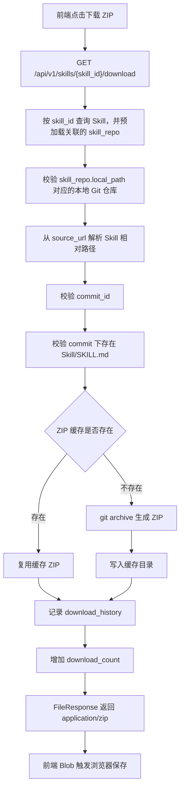
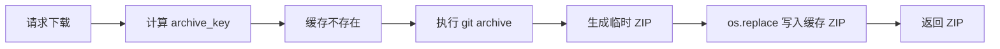
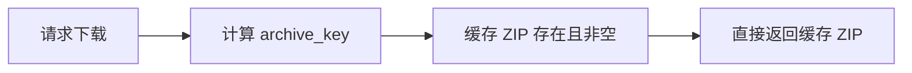
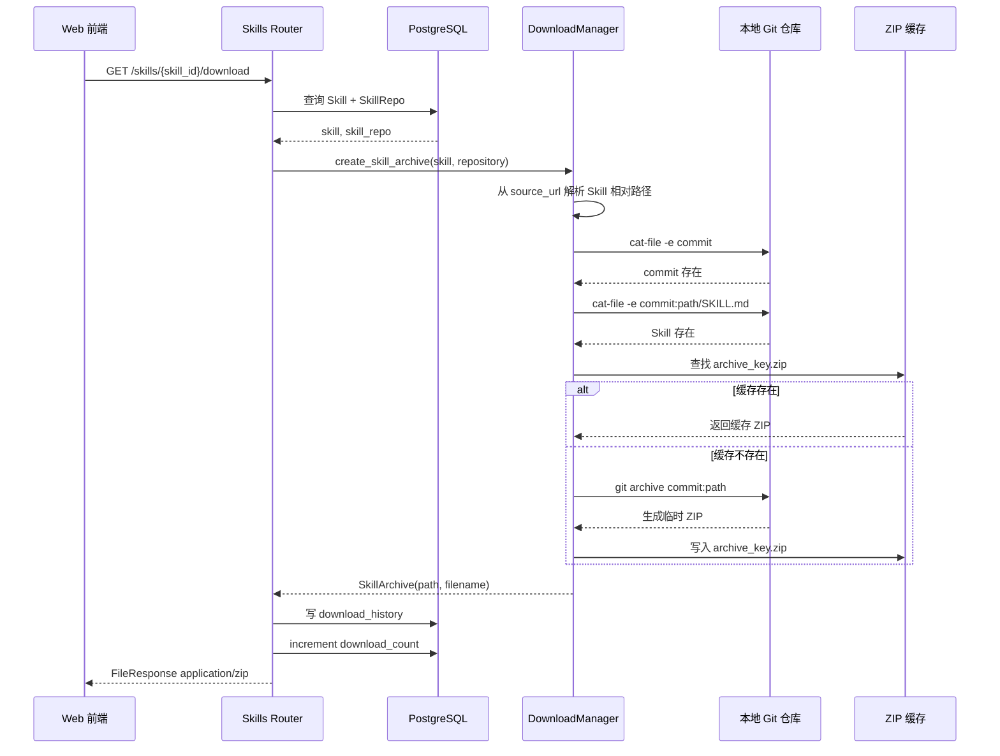
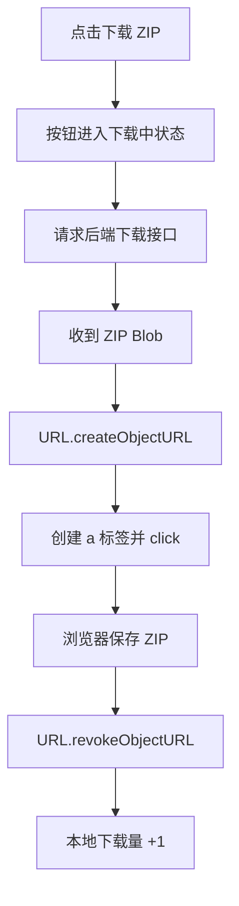

# Skill 本地打包下载设计

## 1. 背景

WittyHub 的爬取阶段已经将 Skill 所属 Git 仓库克隆到本地，并在数据库中记录了：

| 数据 | 来源 | 用途 |
|------|------|------|
| `skills.skill_id` | Skill 索引记录 | 标识 Skill（格式 `{source}:{owner}/{repo}/{skill_name}`） |
| `skills.commit_id` | Skill 索引记录 | 锁定下载内容对应的 Git 提交 |
| `skills.source_url` | Skill 索引记录 | 从浏览 URL 反推 Skill 在仓库中的相对路径 |
| `skills.version` | Skill 索引记录 | 作为 ref 候选项参与路径解析 |
| `skills.name` | Skill 索引记录 | 生成 ZIP 内根目录名和下载文件名 |
| `skills.skill_repo_id` | Skill 索引记录 | 关联所属仓库 |
| `skill_repos.url` | 仓库记录 | 解析 `owner/repo`，校验 `skill_id` 前缀 |
| `skill_repos.source` | 仓库记录 | 校验 `skill_id` 前缀 |
| `skill_repos.branch` | 仓库记录 | 作为 ref 候选项参与路径解析 |
| `skill_repos.local_path` | 仓库记录 | 定位本地 Git 仓库绝对路径 |

`storage.local_path` 是后端和爬虫共享的运行时数据根目录。当前配置为：

```text
/opt/wittyhub/
```

目录布局：

```text
/opt/wittyhub/
├── skill-repositories/      # 爬虫 clone 的 Git 仓库
├── download-cache/          # 下载接口生成的 ZIP 缓存
└── logs/                    # skillcrawler 日志
```

下载接口不再返回远端仓库 URL，而是由后端从本地 Git 仓库导出单个 Skill 目录，生成 ZIP 后直接返回给前端。

---

## 2. 总体流程



核心代码位置：

| 模块 | 职责 |
|------|------|
| `src/api/routes/skills.py` | 下载接口，返回 `FileResponse` |
| `src/models/repository.py` | 查询 Skill 并预加载所属 SkillRepo |
| `src/storage/downloader.py` | 解析路径、校验 Git 对象、生成或复用 ZIP |
| `web/src/api/client.ts` | 以 `responseType: 'blob'` 请求下载 |
| `web/src/pages/SkillDetail.vue` | 下载按钮、下载状态、浏览器保存文件 |

---

## 3. 如何根据 commit 打包

### 3.1 解析 Skill 相对路径

`skill_id` 的格式为 `{source}:{owner}/{repo}/{skill_name}`，其中 `skill_name` 是 SKILL.md 所在目录的名称。`skill_id` **不再编码完整仓库相对路径**，因此下载时需要从 `source_url`（Git 平台浏览 URL）反向解析出 Skill 在仓库中的相对目录。

示例：

```text
skill.skill_id:
gitcode:openeuler/opendesign-components/clean-code

skill.source_url:
https://gitcode.com/openeuler/opendesign-components/blob/master/packages/skills/clean-code/SKILL.md

skill_repo.source:
gitcode

skill_repo.url:
https://gitcode.com/openeuler/opendesign-components
```

解析步骤（[downloader.py `resolve_skill_relative_path`](file:///home/wjh/polymind/wittyhub/src/storage/downloader.py#L85-L118)）：

1. 从 `skill_repo.url` 提取 `owner/repo`（如 `openeuler/opendesign-components`）
2. 拼出前缀 `gitcode:openeuler/opendesign-components/`，校验 `skill_id` 以此前缀开头
3. 遍历 ref 候选列表 `[commit_id, version, branch, 'HEAD', 'master', 'main']`，在 `source_url` 中查找 `/blob/{ref}/` 标记
4. 截取标记之后的文件路径，去掉末尾 `SKILL.md`，得到相对目录

```text
source_url 中找到 /blob/master/ 标记
截取: packages/skills/clean-code/SKILL.md
去掉 SKILL.md: packages/skills/clean-code
```

这个结果就是 Skill 在仓库中的相对目录。

### 3.2 校验 commit 是否存在

后端先校验 `commit_id` 格式，只接受 7 到 64 位十六进制 Git object id。

然后执行等价命令：

```bash
git -C <skill_repo.local_path> cat-file -e <commit_id>^{commit}
```

作用：

| 结果 | 含义 |
|------|------|
| 返回码为 `0` | 本地仓库中存在该 commit |
| 返回码非 `0` | 本地仓库没有该 commit，接口返回 `409` |

### 3.3 校验该 commit 下存在 Skill

后端继续检查指定 commit 中是否存在目标 Skill 的 `SKILL.md`：

```bash
git -C <skill_repo.local_path> cat-file -e <commit_id>:<skill_relative_path>/SKILL.md
```

示例：

```bash
git -C /opt/wittyhub/skill-repositories/gitcode.com_openeuler_opendesign-components \
  cat-file -e \
  130b99b0145a4c357c9ac760b1834375716fdb01:packages/skills/clean-code/SKILL.md
```

这样可以确保下载的确实是一个 Skill 目录，而不是仓库中的普通目录。

### 3.4 使用 git archive 导出指定 commit 下的目录

真正打包时执行等价命令：

```bash
git -C <skill_repo.local_path> \
  archive \
  --format=zip \
  --prefix=<skill_name>/ \
  --output=<temporary_zip_path> \
  <commit_id>:<skill_relative_path>
```

本次示例等价为：

```bash
git -C /opt/wittyhub/skill-repositories/gitcode.com_openeuler_opendesign-components \
  archive \
  --format=zip \
  --prefix=clean-code/ \
  --output=/tmp/clean-code.zip \
  130b99b0145a4c357c9ac760b1834375716fdb01:packages/skills/clean-code
```

关键点：

| 设计 | 说明 |
|------|------|
| 使用 `<commit_id>:<path>` | 从指定 commit 的 Git tree 中导出目录 |
| 不 checkout 分支 | 不改变本地工作区，不影响爬虫更新仓库 |
| 使用 `--prefix=<skill_name>/` | ZIP 内部根目录是 `clean-code/`，不是 `packages/skills/clean-code/` |
| 使用 `--output=<temporary_zip_path>` | 先写临时文件，成功后再进入缓存 |

最终 ZIP 内容类似：

```text
clean-code/
├── SKILL.md
├── eslint.diagnose.ts
└── references/
    ├── config-object.md
    ├── guard-clause.md
    ├── reduce-complexity.md
    └── split-composable.md
```

---

## 4. ZIP 缓存设计

### 4.1 缓存目录

缓存 ZIP 存放在：

```text
<storage.local_path>/download-cache/
```

当前配置下是：

```text
/opt/wittyhub/download-cache/
```

### 4.2 缓存 Key

缓存文件名不直接使用 `skill_id`，而是使用哈希：

```python
sha256(f"{skill_id}:{commit_id}:{relative_path}")
```

生成结果：

```text
download-cache/<archive_key>.zip
```

缓存 Key 包含：

| 字段 | 作用 |
|------|------|
| `skill_id` | 区分不同 Skill |
| `commit_id` | 区分不同 Git 提交版本 |
| `relative_path` | 区分同仓库内不同目录 |

### 4.3 缓存有什么作用

缓存的作用是避免重复执行 `git archive`。

第一次下载：



第二次下载同一个 Skill、同一个 commit、同一个相对路径：



也就是说：会重复利用。下次下载时会先查找缓存包，如果缓存包已经存在且大小大于 0，就不会再次打包。

当前判断逻辑：

```python
if archive_path.is_file() and archive_path.stat().st_size > 0:
    return archive_path
```

### 4.4 为什么缓存是安全的

缓存 Key 包含 `commit_id`，而 Git commit 的内容是不可变的。

因此：

| 情况 | 是否复用旧 ZIP |
|------|----------------|
| 同一个 Skill + 同一个 commit | 复用 |
| 同一个 Skill + 新 commit | 不复用，生成新 ZIP |
| 同仓库另一个 Skill | 不复用 |
| 相同 Skill ID 但相对路径变化 | 不复用 |

### 4.5 临时文件和原子替换

生成 ZIP 时先写临时文件：

```text
.<archive_key>.<uuid>.tmp
```

打包成功后再执行：

```python
os.replace(temporary_path, archive_path)
```

这样可以避免请求读到尚未写完的半成品 ZIP。

---

## 5. 接口流程

### 5.1 后端接口

请求：

```http
GET /api/v1/skills/{skill_id}/download
```

成功响应：

```http
HTTP/1.1 200 OK
Content-Type: application/zip
Content-Disposition: attachment; filename="clean-code-1.1.0.zip"
```

接口内部流程：



### 5.2 前端流程

前端调用：

```ts
const blob = await api.getSkillDownload(skill.value.skill_id)
```

API client 使用：

```ts
client.get(`/skills/${encodeURIComponent(skillId)}/download`, {
  responseType: 'blob',
})
```

页面拿到 `Blob` 后：



---

## 6. 异常处理

| 场景 | 后端状态码 | 说明 |
|------|------------|------|
| Skill 不存在 | `404` | `skill_id` 没有对应记录 |
| SkillRepo 缺失 | `409` | Skill 没有关联仓库信息 |
| `local_path` 为空或不存在 | `409` | 本地仓库不可用 |
| `local_path` 不是 Git 仓库 | `409` | 本地仓库无效 |
| `skill_id` 不属于该仓库 | `409` | 前缀不匹配 |
| `source_url` 无法解析路径 | `404` | 浏览 URL 中找不到已知 ref 的 `/blob/{ref}/` 标记 |
| `commit_id` 缺失或格式非法 | `409` | 不能定位 Git 提交 |
| 本地仓库没有该 commit | `409` | 需要重新同步仓库 |
| 指定 commit 下没有 `SKILL.md` | `404` | 该提交下目标 Skill 不存在 |
| `git archive` 失败 | `500` | 打包失败 |

---

## 7. 设计收益

| 收益 | 说明 |
|------|------|
| 下载内容稳定 | 使用 `commit_id` 锁定索引时的 Git tree |
| 不依赖远端下载 URL | 不受 GitCode/Gitee/GitHub 归档地址差异影响 |
| 只下载单个 Skill | 不把整个仓库传给前端 |
| 不修改本地工作区 | `git archive` 不需要 checkout |
| 可复用缓存 | 同一 Skill 同一 commit 后续下载直接返回缓存 ZIP |
| 前端体验直接 | 浏览器收到 `application/zip` 后保存文件 |
