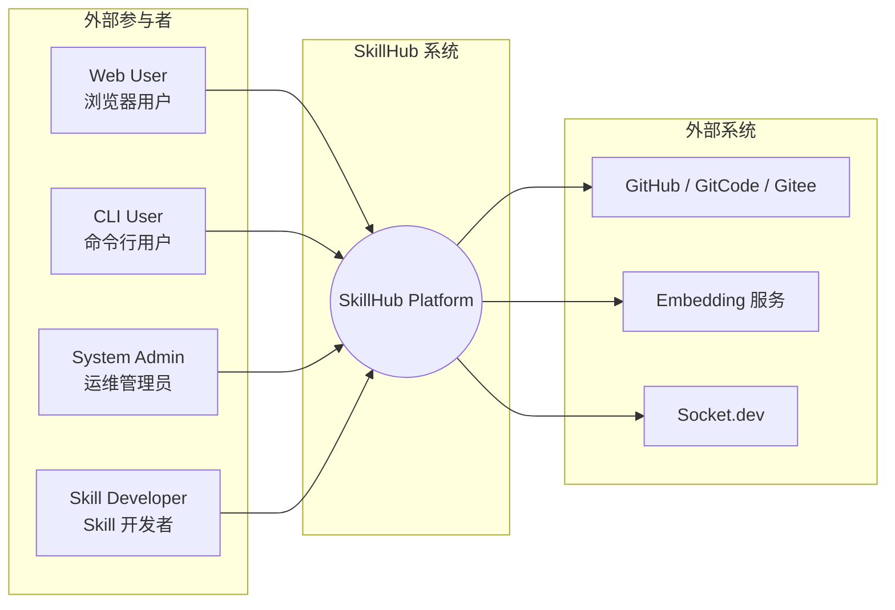
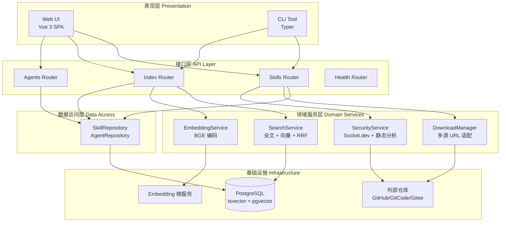
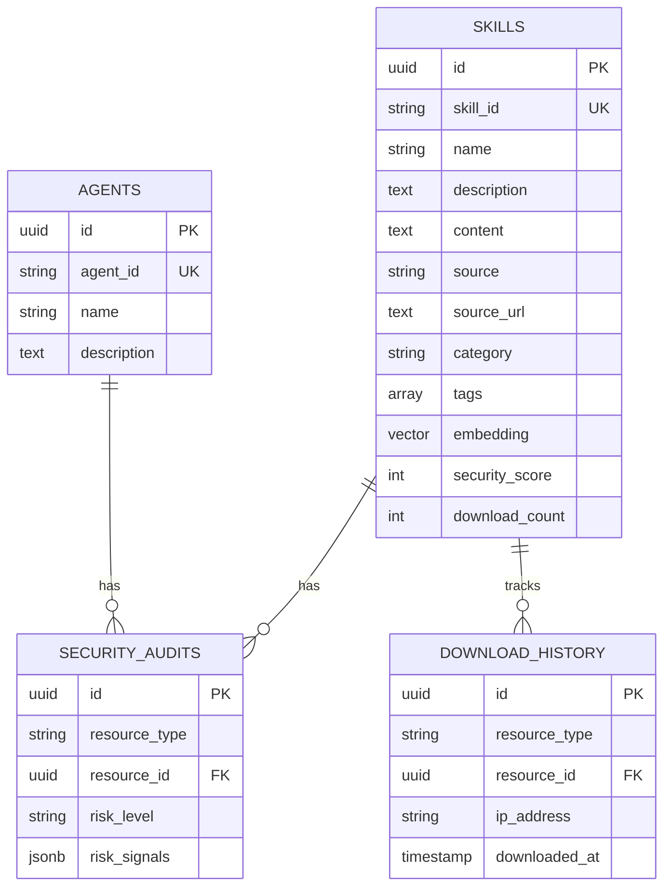
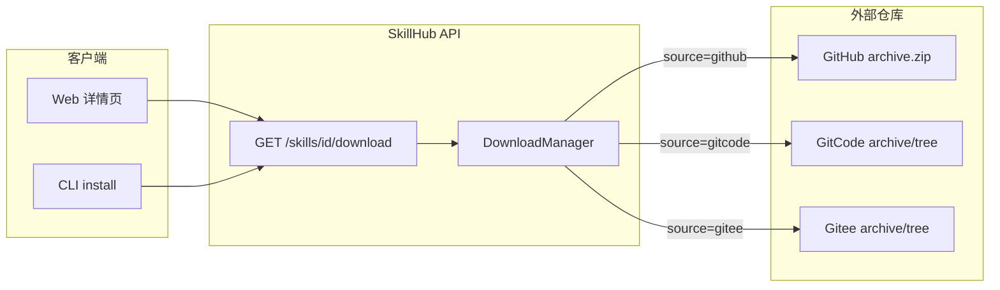
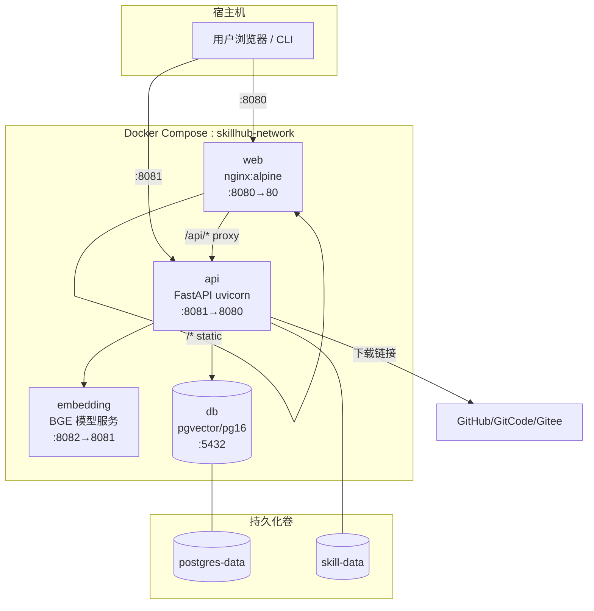
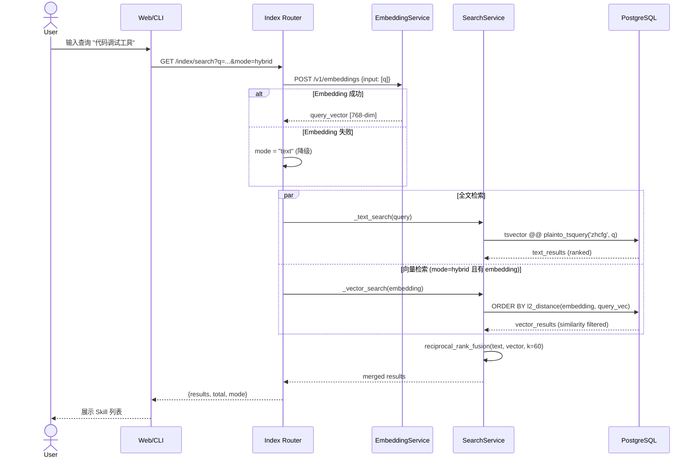
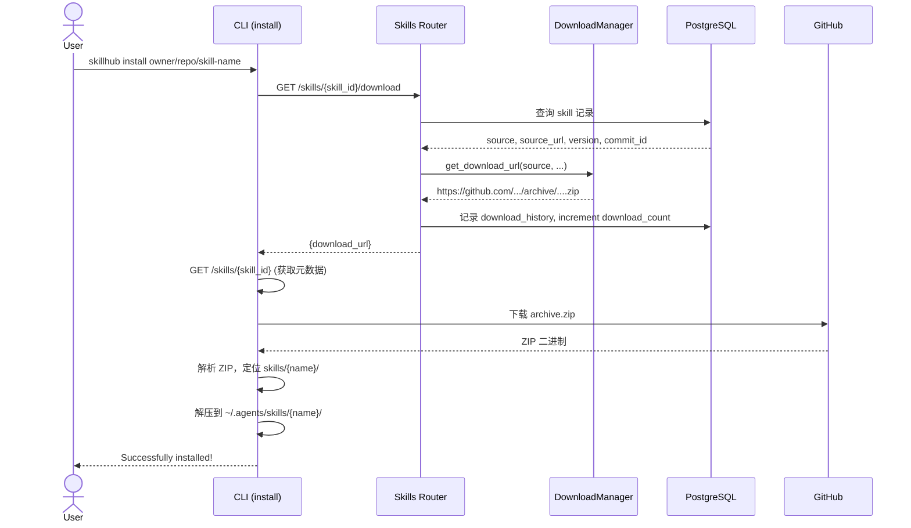
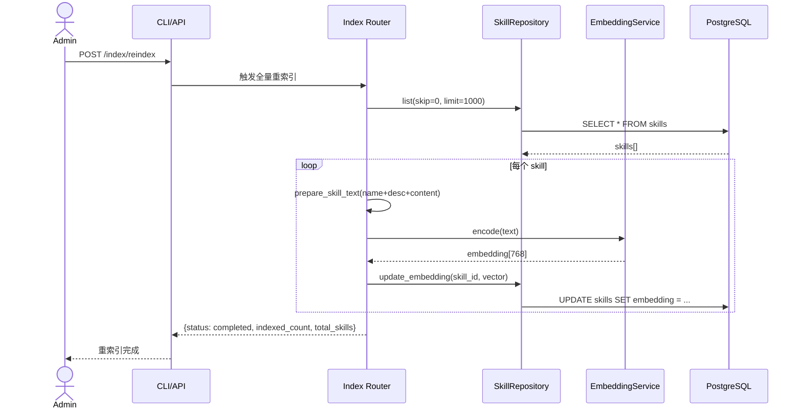
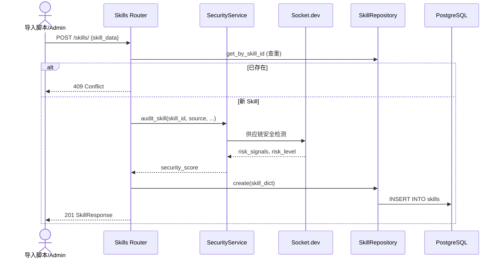

# SkillHub 系统设计说明书

## 文档信息

| 项目 | 内容 |
|------|------|
| 项目名称 | SkillHub - Agent/Skill 检索与下载平台 |
| 文档版本 | v4.0 |
| 文档类型 | 系统设计说明书 |

---

## 1. 系统概述

### 1.1 系统定位

SkillHub 是一个去中心化的 Agent/Skill 检索与下载平台。平台本地只存储索引元数据，Skill 内容托管在 GitHub / GitCode / Gitee 等外部仓库，通过 REST API、Web UI 和 CLI 三种方式对外提供服务。

### 1.2 核心设计原则

| 原则 | 说明 |
|------|------|
| 去中心化 | 内容在外部仓库，本地仅存索引，降低审查与存储成本 |
| 单库多能力 | PostgreSQL 同时承担关系存储、全文检索（tsvector）、向量检索（pgvector） |
| 搜索可降级 | Embedding 服务不可用时自动回退到全文搜索 |
| 多源下载适配 | 统一 DownloadManager 抽象，按 source 生成各平台下载 URL |
| 安全优先 | 入库触发 Socket.dev + 静态规则检测，输出风险评分 |

### 1.3 技术栈

| 层级 | 技术选型 |
|------|----------|
| API 层 | Python FastAPI + SQLAlchemy (async) + Pydantic |
| 数据层 | PostgreSQL 16 + pgvector + tsvector (zhcfg) |
| 语义检索 | BGE-base-zh-v1.5 Embedding 服务（OpenAI 兼容 API） |
| 前端 | Vue 3 + TypeScript + Tailwind CSS + Vite |
| CLI | Python Typer + httpx |
| 部署 | Docker Compose（db / embedding / api / web） |

---

## 2. 用例视图



| 参与者 | 说明 | 典型操作 |
|--------|------|----------|
| Web User | 浏览器访问平台 | 搜索、浏览详情、查看安全报告、获取安装命令 |
| CLI User | 使用 `skillhub` 命令行 | search / install / download / audit |
| System Admin | 运维人员 | 触发重索引、查看统计、Docker 部署 |
| Skill Developer | 本地管理 Skill | install 到 `~/.agents/skills/` |

### 2.2 用例清单

| 用例 ID | 名称 | 参与者 | 状态 | 优先级 |
|---------|------|--------|------|--------|
| UC-1 | 搜索 Skill（全文/语义/混合） | Web User, CLI User | 已实现 | P0 |
| UC-2 | 浏览 Skill 详情 | Web User | 已实现 | P0 |
| UC-3 | 查看安全报告 | Web User, CLI User | 已实现 | P0 |
| UC-4 | 分类/标签浏览 | Web User | 已实现 | P1 |
| UC-5 | 查看下载排行榜 | Web User | 已实现 | P2 |
| UC-6 | CLI 搜索 Skill | CLI User | 已实现 | P0 |
| UC-7 | CLI 安装 Skill 到本地 | CLI User, Skill Developer | 已实现 | P0 |
| UC-8 | CLI 获取下载链接 | CLI User | 已实现 | P0 |
| UC-9 | CLI 安全审计 | CLI User | 已实现 | P0 |
| UC-10 | 触发向量重索引 | System Admin, CLI User | 已实现 | P1 |
| UC-11 | 查看系统统计 | System Admin | 已实现 | P1 |
| UC-12 | 多版本历史查询 | CLI User, Web User | 已实现 | P1 |
| UC-13 | 爬虫自动发现 | System Admin | 待开发 | P1 |

---

## 3. 逻辑视图

### 3.1 分层架构



### 3.2 模块职责

| 模块 | 路径 | 职责 |
|------|------|------|
| Web UI | `web/` | 搜索、详情、分类、排行榜页面 |
| REST API | `src/api/` | 路由编排、请求校验、响应序列化 |
| SearchService | `src/indexer/search.py` | 全文检索、向量检索、RRF 混合排序 |
| EmbeddingService | `src/ai/embedding.py` | 调用 BGE 模型生成查询/文档向量 |
| DownloadManager | `src/storage/downloader.py` | 多平台下载 URL 格式化与本地存储 |
| SecurityDetector | `src/security/detector.py` | 供应链安全检测与风险评分 |
| Repository | `src/api/models/repository.py` | 数据库 CRUD 与统计查询 |
| CLI | `cli/` | 命令行封装，install 含 ZIP 解压逻辑 |

### 3.3 包依赖关系

```
web/ ──HTTP──► src/api/routes/*
cli/ ──HTTP──► src/api/routes/*
src/api/routes/index.py ──► src/indexer/search.py
                          ──► src/ai/embedding.py
src/api/routes/skills.py ──► src/storage/downloader.py
                           ──► src/api/services/security.py
src/indexer/search.py ──► PostgreSQL (tsvector + pgvector)
src/ai/embedding.py ──► Embedding 微服务 (HTTP)
src/storage/downloader.py ──► GitHub/GitCode/Gitee (HTTP)
```

### 3.4 数据模型（逻辑）



---

## 4. 关键问题与解决方案

本节聚焦系统最核心的三个技术难题：**语义检索**、**多源下载**、**容器化部署**。

### 4.1 语义检索方案

#### 4.1.1 问题陈述

| 挑战 | 描述 |
|------|------|
| 关键词局限 | 用户查询「帮我调试 Python 代码」无法匹配名为 `debug-helper` 的 Skill |
| 中文分词 | 需要支持中英文混合 Skill 描述的全文检索 |
| 检索精度与召回 | 单一检索方式难以兼顾精确匹配与语义理解 |
| 服务可用性 | Embedding 模型较重，需独立部署且支持降级 |

#### 4.1.2 总体方案：单库双索引 + 混合排序

```
┌─────────────────────────────────────────────────────────────────┐
│                     语义检索架构                                  │
├─────────────────────────────────────────────────────────────────┤
│                                                                 │
│  用户查询 "代码调试工具"                                           │
│       │                                                         │
│       ▼                                                         │
│  ┌─────────────┐     ┌──────────────────┐                        │
│  │ Index API   │────►│ EmbeddingService │──► BGE-base-zh-v1.5  │
│  │ mode=hybrid │     │ (768-dim vector) │    (独立 Docker 容器)   │
│  └──────┬──────┘     └──────────────────┘                        │
│         │                                                       │
│         ├──────────────────┬──────────────────┐                 │
│         ▼                  ▼                  ▼                 │
│  ┌─────────────┐   ┌─────────────┐   ┌─────────────┐           │
│  │ 全文检索     │   │ 向量检索     │   │ RRF 融合     │           │
│  │ tsvector    │   │ pgvector    │   │ k=60        │           │
│  │ zhcfg       │   │ L2 distance │   │             │           │
│  └─────────────┘   └─────────────┘   └─────────────┘           │
│         │                  │                  │                 │
│         └──────────────────┴──────────────────┘                 │
│                            ▼                                    │
│                    排序后的 Skill 列表                            │
└─────────────────────────────────────────────────────────────────┘
```

#### 4.1.3 三种搜索模式

| 模式 | 参数值 | 行为 | 适用场景 |
|------|--------|------|----------|
| 全文 | `text` | 仅 tsvector + ILIKE 兜底 | 精确关键词、Embedding 不可用时 |
| 语义 | `semantic` | 仅 pgvector 余弦/L2 相似度 | 自然语言描述、概念搜索 |
| 混合 | `hybrid`（默认） | 双路检索 + RRF 融合 | 兼顾精度与召回 |

#### 4.1.4 全文检索实现

- **分词配置**：`zhcfg`（基于 `simple` + `unaccent`），适配中英文混合文本
- **索引字段**：`name || description || content` 拼接后 `to_tsvector('zhcfg', ...)`
- **查询方式**：`plainto_tsquery` + `ts_rank` 排序，辅以 `ILIKE` 模糊匹配兜底
- **二次排序**：相同 rank 时按 `download_count DESC` 打破平局

#### 4.1.5 向量检索实现

- **模型**：BAAI/bge-base-zh-v1.5，768 维
- **文档向量**：`name + description + content` 拼接文本编码后存入 `skills.embedding`
- **查询向量**：用户搜索词实时编码（不持久化）
- **相似度计算**：`l2_distance(embedding, query_vector)`，转换为 `similarity = 1 / (1 + distance)`
- **阈值过滤**：`min_similarity = 0.47`，过滤低相关结果

#### 4.1.6 RRF 混合排序

Reciprocal Rank Fusion 将两路排序列表合并，无需分数归一化：

```
RRF_score(d) = Σ  1 / (k + rank_i(d))     , k = 60
```

实现位于 `src/indexer/search.py` 的 `reciprocal_rank_fusion()`，各路先取 `limit * 2` 候选再融合分页。

#### 4.1.7 索引构建与重索引

| 触发方式 | 端点 | 行为 |
|----------|------|------|
| 全量重索引 | `POST /api/v1/index/reindex` | 遍历 skills，批量生成 embedding 并更新 |
| 单条重索引 | `POST /api/v1/index/reindex/{skill_id}` | 针对单个 Skill 更新向量 |
| CLI 触发 | `skillhub reindex` | 调用全量重索引 API |

#### 4.1.8 降级策略

```python
# src/api/routes/index.py 核心逻辑
if mode in ("semantic", "hybrid") and semantic_enabled:
    try:
        embedding = await generate_embeddings([q])
    except Exception:
        embedding = None
        mode = "text"          # Embedding 失败 → 全文搜索

if embedding is None:
    mode = "text"              # 无向量 → 全文搜索
```

配置项 `ai.enable_semantic_search: false` 时使用 MockEmbeddingService，仅用于测试环境。

#### 4.1.9 数据库扩展初始化

```sql
-- deploy/docker/init.sql
CREATE EXTENSION IF NOT EXISTS "vector";
CREATE EXTENSION IF NOT EXISTS "unaccent";
CREATE TEXT SEARCH CONFIGURATION zhcfg (COPY = pg_catalog.simple);
ALTER TEXT SEARCH CONFIGURATION zhcfg
  ALTER MAPPING FOR asciiword, word WITH unaccent, simple;
```

---

### 4.2 多源下载方案

#### 4.2.1 问题陈述

| 挑战 | 描述 |
|------|------|
| 多平台差异 | GitHub 提供 archive.zip，GitCode/Gitee 目录结构不同 |
| 去中心化 | 平台不托管 Skill 内容，只返回外部下载链接 |
| 版本锁定 | 需支持 branch / tag / commit_id 三种版本粒度 |
| CLI 安装 | 需从 ZIP 中定位 `skills/{skill-name}/` 子目录并解压到本地 |

#### 4.2.2 下载架构



#### 4.2.3 URL 格式化规则

| 来源 | 条件 | 生成 URL 格式 |
|------|------|---------------|
| GitHub | 有 commit_id | `https://github.com/{owner}/{repo}/archive/{commit_id}.zip` |
| GitHub | 有 version (branch) | `https://github.com/{owner}/{repo}/archive/refs/heads/{version}.zip` |
| GitCode | 有 commit_id | `https://gitcode.com/{owner}/{repo}/archive/{commit_id}.zip` |
| GitCode | 有 skill_id | `https://gitcode.com/{owner}/{repo}/tree/{version}/skills/{skill_name}` |
| Gitee | 同 GitCode 规则 | `https://gitee.com/{owner}/{repo}/...` |

核心实现：`src/storage/downloader.py` → `DownloadManager.get_download_url()`

#### 4.2.4 下载流程（API 侧）

1. 根据 `skill_id` 查询索引记录，获取 `source`、`source_url`、`version`、`commit_id`
2. `DownloadManager` 按 source 格式化下载 URL
3. 写入 `download_history`（IP、User-Agent）
4. `download_count` 自增
5. 返回 `{ download_url }` 给客户端

#### 4.2.5 CLI 安装流程（客户端侧）

CLI `install` 命令在客户端完成实际下载与解压，平台不参与文件传输：

```
1. 调用 API 获取 download_url 和 skill 元数据
2. 下载 archive.zip（urllib）
3. 解析 ZIP，定位 skills/{skill-name}/ 目录
   - 精确匹配 skill 文件夹名
   - 模糊匹配（去连字符/下划线后比较）
4. 解压到 ~/.agents/skills/{skill_relative_path}/
5. 若目录已存在则先删除再安装
```

本地目录结构：

```
~/.agents/skills/
├── find-skills/
│   ├── SKILL.md
│   └── ...
└── frontend-design/
    └── ...
```

#### 4.2.6 中国区优化

GitCode / Gitee 作为国内镜像，DownloadManager 针对其 URL 模式单独适配；GitHub 请求可配置 `github_token` 提高 rate limit。

---

### 4.3 容器化部署方案

#### 4.3.1 问题陈述

| 挑战 | 描述 |
|------|------|
| 组件依赖 | API 依赖 PostgreSQL（含 pgvector）和 Embedding 服务 |
| 启动顺序 | Embedding 模型加载慢（~120s），需 healthcheck 协调 |
| 前后端分离 | SPA 静态资源与 API 需统一入口 |
| 开发/生产差异 | 开发环境挂载源码热重载，生产环境只读镜像 |

#### 4.3.2 部署拓扑



#### 4.3.3 服务清单

| 服务 | 镜像/构建 | 端口 | 依赖 | 说明 |
|------|-----------|------|------|------|
| db | pgvector/pgvector:pg16 | 5432 | — | 初始化 init.sql（扩展 + 表结构） |
| embedding | embedding.Dockerfile | 8082→8081 | — | BGE 模型，内存限制 4G，启动 ~120s |
| api | deploy/docker/Dockerfile | 8081→8080 | db ✓, embedding ✓ | FastAPI，挂载 config.docker.yaml |
| web | nginx:alpine | 8080→80 | api | 静态 SPA + `/api/` 反向代理 |

#### 4.3.4 Nginx 路由规则

| 路径 | 目标 | 说明 |
|------|------|------|
| `/` | `web/dist/index.html` | SPA fallback (`try_files`) |
| `/api/` | `http://api:8080/api/` | 反向代理到 FastAPI |
| `/assets/` | 静态文件 | 1 年缓存 |

#### 4.3.5 健康检查与启动顺序

```yaml
# 启动依赖链
db (pg_isready) ──► embedding (HTTP /health) ──► api (HTTP /api/v1/health) ──► web
```

| 服务 | 检查方式 | 间隔 | 启动宽限期 |
|------|----------|------|------------|
| db | `pg_isready` | 10s | — |
| embedding | `GET /health` | 30s | 120s |
| api | `GET /api/v1/health` | 30s | 40s |

#### 4.3.6 配置管理

Docker 环境使用 `deploy/docker/config.docker.yaml`：

```yaml
database:
  host: "db"                    # Docker 网络内服务名

ai:
  embedding_host: "http://embedding:8081"
  embedding_model: "BAAI/bge-base-zh-v1.5"
  embedding_dimension: 768
  enable_semantic_search: true

storage:
  local_path: "/data/skills"    # 挂载 skill-data 卷
```

环境变量 `SKILLHUB_CONFIG` 指向配置文件路径；数据库连接亦可通过 `DATABASE__*` 环境变量覆盖。

#### 4.3.7 一键部署

```bash
cd deploy/docker
docker compose up -d

# 验证
curl http://localhost:8081/api/v1/health    # API
curl http://localhost:8080/                  # Web
curl "http://localhost:8081/api/v1/index/search?q=调试&mode=hybrid"  # 搜索
```

---

## 5. 时序图

### 5.1 混合搜索（UC-1）



### 5.2 Skill 下载与 CLI 安装（UC-7 / UC-8）



### 5.3 向量重索引（UC-10）



### 5.4 Skill 入库与安全审计



---

## 6. 关键用例设计

### 6.1 UC-1：混合搜索 Skill

**目标**：用户输入自然语言或关键词，返回最相关的 Skill 列表。

**前置条件**：PostgreSQL 已启用 pgvector；skills 表已有 embedding 数据（或降级为全文搜索）。

**主成功场景**：

| 步骤 | 动作 | 组件 |
|------|------|------|
| 1 | 用户提交搜索请求，指定 `mode=hybrid` | Web / CLI |
| 2 | API 对查询词生成 768 维向量 | EmbeddingService |
| 3 | 并行执行全文检索与向量检索 | SearchService |
| 4 | RRF 融合两路结果，应用 category/platform/tags 过滤 | SearchService |
| 5 | 分页返回 `{results, total, mode}` | Index Router |

**扩展场景**：

| 条件 | 行为 |
|------|------|
| Embedding 服务不可用 | 自动降级为 `mode=text` |
| `mode=semantic` 但无 embedding 数据 | 返回空或降级 |
| 指定 category/tags 过滤 | 两路检索均应用 WHERE 条件 |

**接口**：

```
GET /api/v1/index/search?q={query}&mode=hybrid&category=&tags=&skip=0&limit=20
```

---

### 6.2 UC-7：CLI 安装 Skill

**目标**：一键将远程 Skill 安装到本地 Agent 技能目录。

**前置条件**：Skill 已索引；用户网络可访问外部仓库。

**主成功场景**：

| 步骤 | 动作 |
|------|------|
| 1 | CLI 调用 download API 获取 ZIP 下载链接 |
| 2 | CLI 调用 get API 获取 skill 元数据（version 等） |
| 3 | 下载 archive.zip |
| 4 | 在 ZIP 中定位 `skills/{skill-name}/` 目录 |
| 5 | 解压到 `~/.agents/skills/{path}/` |
| 6 | 输出安装路径 |

**异常场景**：

| 条件 | 行为 |
|------|------|
| ZIP 中找不到 skill 目录 | 列出可用 skills 子目录，提示手动下载 |
| 下载超时/失败 | 输出 download_url 供手动下载 |
| 目标目录已存在 | 先删除再安装 |

**命令**：

```bash
skillhub install vercel-labs/skills/find-skills
skillhub install anthropics/skills/frontend-design --target ./my-skills
```

---

### 6.3 UC-10：触发向量重索引

**目标**：Skill 内容更新后，重新生成 embedding 以保持语义搜索准确性。

**触发时机**：批量导入新 Skill、Skill content 变更、Embedding 模型升级。

**流程**：

1. 遍历 skills 表（当前 limit=1000，大批量需分批扩展）
2. 拼接 `name + description + content` 为文档文本
3. 调用 Embedding 服务编码
4. 更新 `skills.embedding` 列
5. 返回 `{indexed_count, total_skills}`

**命令**：

```bash
skillhub reindex
# 或
curl -X POST http://localhost:8081/api/v1/index/reindex
```

---

## 7. 部署视图

### 7.1 物理/逻辑部署图

```
┌──────────────────────────────────────────────────────────────────────────┐
│  Host Machine                                                            │
│                                                                          │
│  ┌────────────────────────────────────────────────────────────────────┐  │
│  │  Docker Network: skillhub-network                                  │  │
│  │                                                                    │  │
│  │  ┌─────────────┐   proxy /api/   ┌─────────────┐                  │  │
│  │  │  web:80     │──────────────►│  api:8080   │                  │  │
│  │  │  (nginx)    │               │  (FastAPI)  │                  │  │
│  │  │  :8080      │               │  :8081      │                  │  │
│  │  └─────────────┘               └──────┬──────┘                  │  │
│  │        ▲                              │                          │  │
│  │        │ static files                 │ SQL                      │  │
│  │   web/dist/                           ▼                          │  │
│  │                              ┌─────────────┐   HTTP   ┌────────┐│  │
│  │                              │  db:5432    │          │embedding││  │
│  │                              │ (pgvector)  │          │ :8081  ││  │
│  │                              └──────┬──────┘          └────────┘│  │
│  │                                     │                            │  │
│  │                              postgres-data                       │  │
│  │                              skill-data                          │  │
│  └────────────────────────────────────────────────────────────────────┘  │
│                                                                          │
│  External: GitHub / GitCode / Gitee / Socket.dev                        │
└──────────────────────────────────────────────────────────────────────────┘
```

### 7.2 端口映射

| 外部端口 | 内部服务 | 用途 |
|----------|----------|------|
| 8080 | web (nginx) | Web UI 入口 |
| 8081 | api (FastAPI) | REST API 直连（CLI / 调试） |
| 8082 | embedding | Embedding 服务（通常仅内部访问） |
| 5432 | db | PostgreSQL（开发调试） |

### 7.3 资源需求

| 服务 | CPU | 内存 | 磁盘 |
|------|-----|------|------|
| db | 1 核 | 512MB+ | postgres-data 卷 |
| embedding | 2 核+ | 4GB（限制） | 模型镜像 ~1.5GB |
| api | 1 核 | 256MB+ | skill-data 卷 |
| web | — | 64MB | web/dist 静态文件 |

### 7.4 部署验证清单

- [ ] `docker compose up -d` 四服务均为 healthy
- [ ] `GET /api/v1/health` 返回 200
- [ ] `GET /api/v1/index/search?q=测试&mode=hybrid` 返回结果
- [ ] Web 首页 `http://localhost:8080` 可访问
- [ ] PostgreSQL 扩展：`vector`, `pg_trgm`, `unaccent`, `zhcfg`
- [ ] `skillhub search "调试"` 与 `skillhub install <id>` 正常

---

## 8. 接口与 CLI 摘要

### 8.1 核心 API

| 方法 | 路径 | 说明 |
|------|------|------|
| GET | `/api/v1/index/search` | 搜索（mode: text/semantic/hybrid） |
| POST | `/api/v1/index/reindex` | 全量向量重索引 |
| GET | `/api/v1/skills/{skill_id}/download` | 获取下载链接 |
| GET | `/api/v1/skills/{skill_id}/audit` | 安全审计报告 |
| GET | `/api/v1/health` | 健康检查 |

### 8.2 CLI 命令

| 命令 | 说明 |
|------|------|
| `search` | 调用混合搜索 API |
| `install` | 下载 ZIP 并解压到本地 |
| `download` | 仅获取下载 URL |
| `audit` | 查看安全审计 |
| `reindex` | 触发向量重索引 |

---

## 9. 待实现功能

| 优先级 | 功能 | 说明 |
|--------|------|------|
| P1 | 爬虫自动发现 | 定时扫描 GitHub/GitCode/Gitee，自动入库 |
| P2 | 标签页浏览 | `/tags` 端点 + 前端标签页 |
| P2 | 开发者页 | 按 author 聚合 Skill 列表 |
| P3 | CLI 离线索引 | 本地缓存索引，无网络时搜索 |

---

## 附录

### A. 术语表

| 术语 | 说明 |
|------|------|
| skill_id | Skill 唯一标识，格式 `owner/repo/skill-name` |
| tsvector | PostgreSQL 全文搜索向量类型 |
| pgvector | PostgreSQL 向量相似度扩展 |
| RRF | Reciprocal Rank Fusion，多路排序融合算法 |
| zhcfg | 中英文混合全文搜索配置 |
| BGE | BAAI General Embedding，中文语义向量模型 |

### B. 关键源码索引

| 功能 | 文件 |
|------|------|
| 混合搜索 + RRF | `src/indexer/search.py` |
| Embedding 编码 | `src/ai/embedding.py` |
| 搜索 API + 重索引 | `src/api/routes/index.py` |
| 下载 URL 格式化 | `src/storage/downloader.py` |
| CLI 安装解压 | `cli/main.py` (install 命令) |
| Docker 编排 | `deploy/docker/docker-compose.yaml` |
| Nginx 配置 | `deploy/docker/nginx.conf` |
| DB 初始化 | `deploy/docker/init.sql` |

