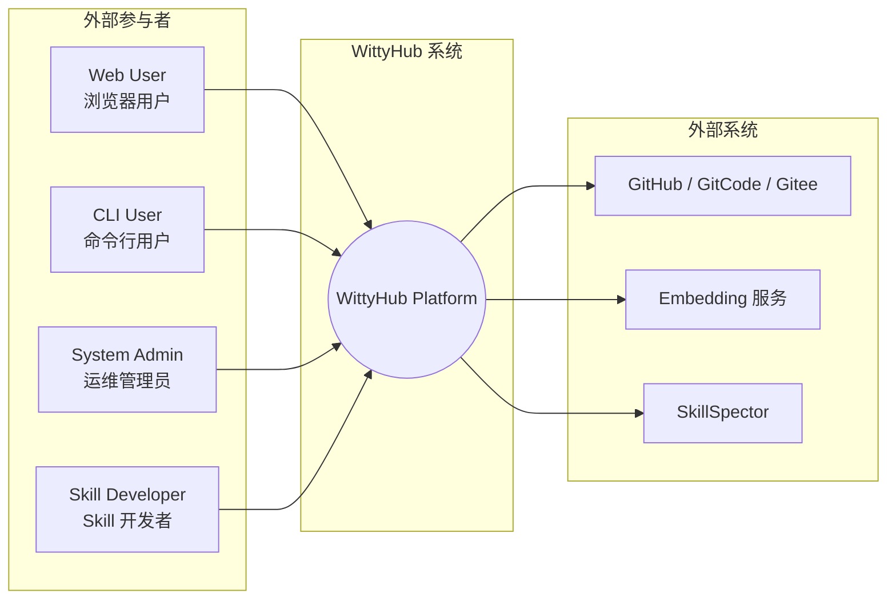
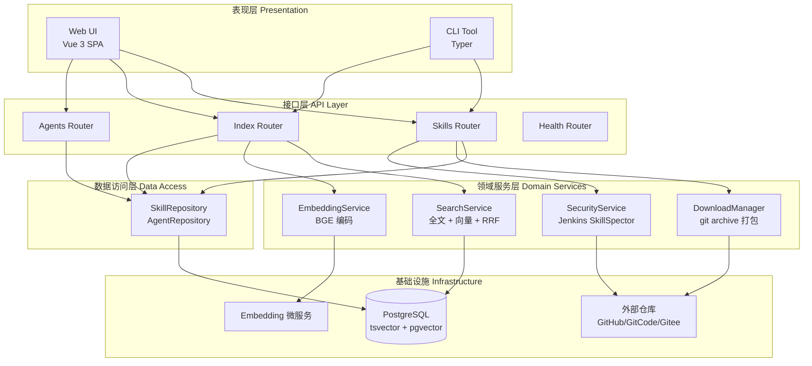
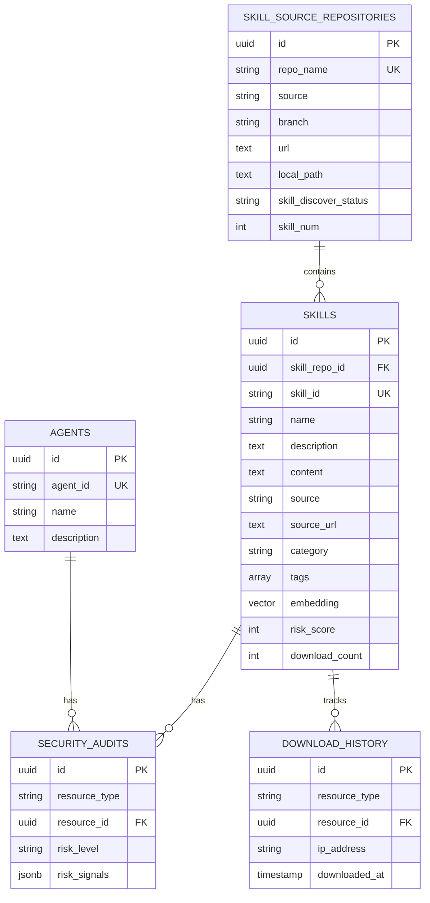
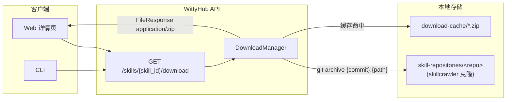
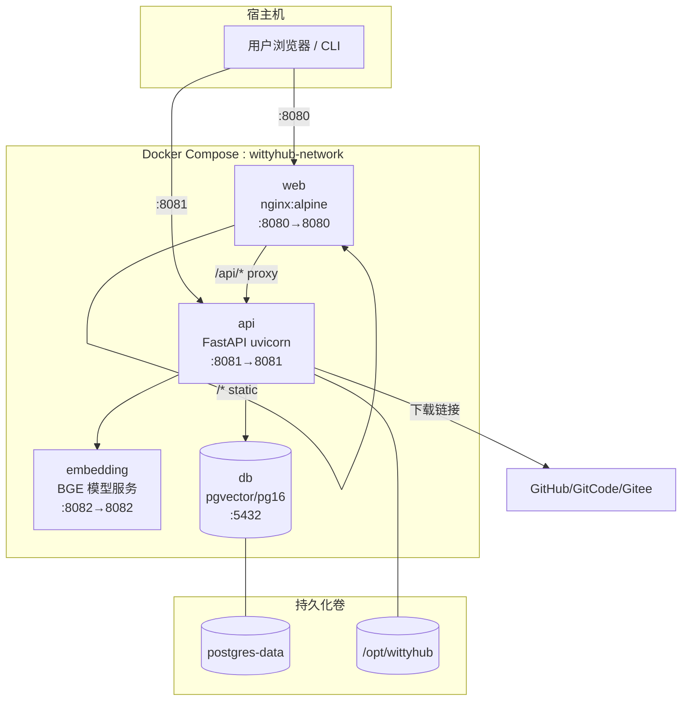
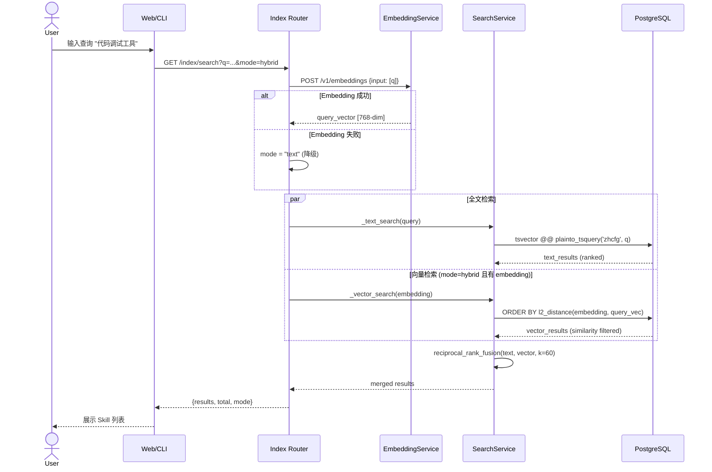
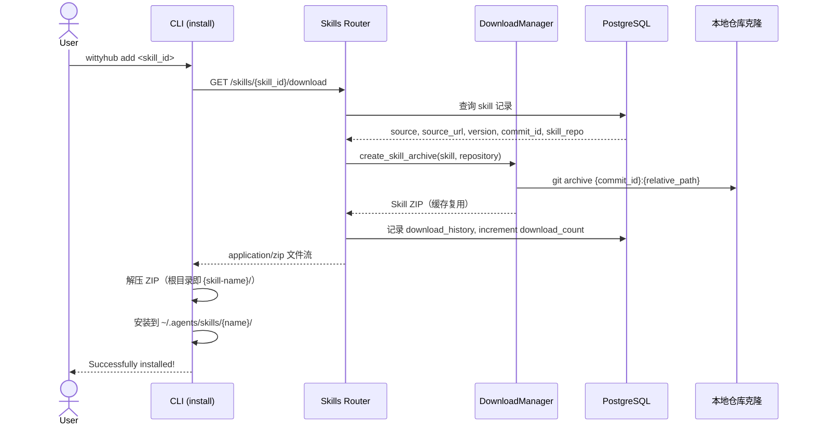
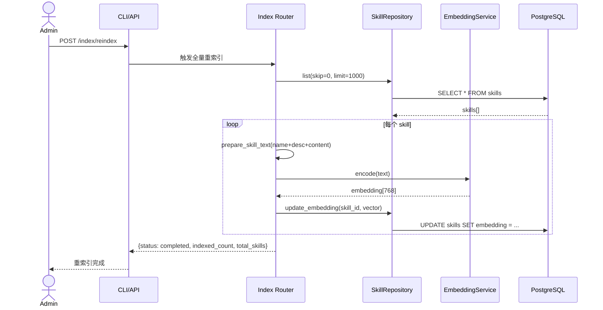
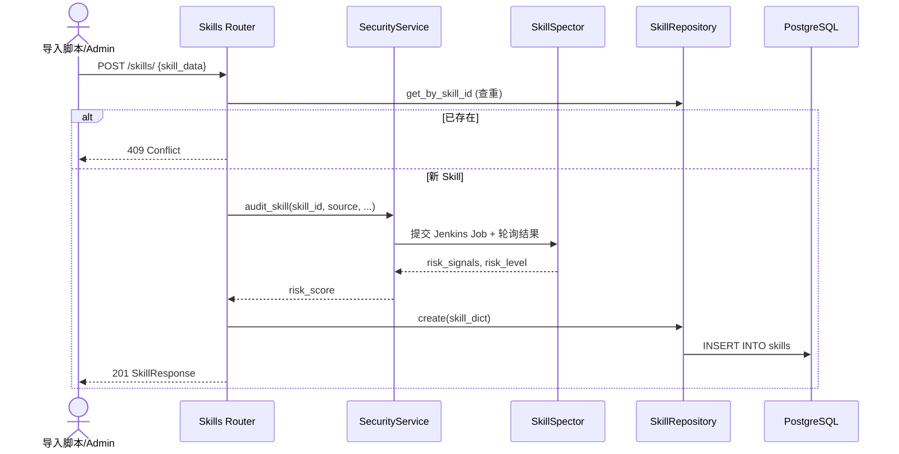

# WittyHub 系统设计说明书

## 文档信息

| 项目 | 内容 |
|------|------|
| 项目名称 | WittyHub - Agent/Skill 检索与下载平台 |
| 文档版本 | v5.0 |
| 文档类型 | 系统设计说明书 |

---

## 1. 系统概述

### 1.1 系统定位

WittyHub 是一个去中心化的 Agent/Skill 检索与下载平台。平台本地只存储索引元数据，Skill 内容托管在 GitHub / GitCode / Gitee 等外部仓库，通过 REST API、Web UI 和 CLI 三种方式对外提供服务。

### 1.2 核心设计原则

| 原则 | 说明 |
|------|------|
| 去中心化 | 内容在外部仓库，本地仅存索引，降低审查与存储成本 |
| 单库多能力 | PostgreSQL 同时承担关系存储、全文检索（tsvector）、向量检索（pgvector） |
| 搜索可降级 | Embedding 服务不可用时自动回退到全文搜索 |
| 多源下载适配 | DownloadManager 基于 skillcrawler 本地克隆 `git archive` 打包，缓存复用 |
| 安全优先 | 入库触发 Jenkins SkillSpector（NVIDIA）深度扫描，输出风险评分 |

### 1.3 技术栈

| 层级 | 技术选型 |
|------|----------|
| API 层 | Python FastAPI + SQLAlchemy (async) + Pydantic |
| 数据层 | PostgreSQL 16 + pgvector + tsvector (zhcfg) |
| 语义检索 | BGE-base-zh-v1.5 Embedding 服务（OpenAI 兼容 API） |
| 前端 | Vue 3 + TypeScript + Tailwind CSS + Vite |
| CLI | Python Typer + httpx |
| 部署 | Docker Compose（db / embedding / api / web） |

---

## 2. 用例视图



| 参与者 | 说明 | 典型操作 |
|--------|------|----------|
| Web User | 浏览器访问平台 | 搜索、浏览详情、查看安全报告、获取安装命令 |
| CLI User | 使用 `wittyhub` 命令行 | search / install / download / audit |
| System Admin | 运维人员 | 触发重索引、查看统计、Docker 部署 |
| Skill Developer | 本地管理 Skill | install 到 `~/.agents/skills/` |

### 2.2 用例清单

| 用例 ID | 名称 | 参与者 | 状态 | 优先级 |
|---------|------|--------|------|--------|
| UC-1 | 搜索 Skill（全文/语义/混合） | Web User, CLI User | 已实现 | P0 |
| UC-2 | 浏览 Skill 详情 | Web User | 已实现 | P0 |
| UC-3 | 查看安全报告 | Web User, CLI User | 已实现 | P0 |
| UC-4 | 分类/标签浏览 | Web User | 已实现 | P1 |
| UC-5 | 查看下载排行榜 | Web User | 已实现 | P2 |
| UC-6 | CLI 搜索 Skill | CLI User | 已实现 | P0 |
| UC-7 | CLI 安装 Skill 到本地 | CLI User, Skill Developer | 已实现 | P0 |
| UC-8 | CLI 获取下载链接 | CLI User | 已实现 | P0 |
| UC-9 | CLI 安全审计 | CLI User | 已实现 | P0 |
| UC-10 | 触发向量重索引 | System Admin, CLI User | 已实现 | P1 |
| UC-11 | 查看系统统计 | System Admin | 已实现 | P1 |
| UC-12 | 多版本历史查询 | CLI User, Web User | 已实现 | P1 |
| UC-13 | 爬虫自动发现 | System Admin | 已实现 | P1 |

---

## 3. 逻辑视图

### 3.1 分层架构



### 3.2 模块职责

| 模块 | 路径 | 职责 |
|------|------|------|
| Web UI | `web/` | 搜索、详情、分类、排行榜页面 |
| REST API | `src/api/` | 路由编排、请求校验、响应序列化 |
| SearchService | `src/indexer/search.py` | 全文检索、向量检索、RRF 混合排序 |
| EmbeddingService | `src/ai/embedding.py` | 调用 BGE 模型生成查询/文档向量 |
| DownloadManager | `src/storage/downloader.py` | 多平台下载 URL 格式化与本地存储 |
| SecurityDetector | `src/security/detector.py` | 供应链安全检测与风险评分 |
| Repository | `src/models/repository.py` | 数据库 CRUD 与统计查询 |
| SkillCrawler | `skillcrawler/` | 技能仓库爬取、发现、分类 |

### 3.3 包依赖关系

```
web/ ──HTTP──► src/api/routes/*
skillcrawler/ ──► src/models/repository.py
src/api/routes/index.py ──► src/indexer/search.py
                          ──► src/ai/embedding.py
src/api/routes/skills.py ──► src/storage/downloader.py
                           ──► src/api/services/security.py
src/indexer/search.py ──► PostgreSQL (tsvector + pgvector)
src/ai/embedding.py ──► Embedding 微服务 (HTTP)
src/storage/downloader.py ──► GitHub/GitCode/Gitee (HTTP)
```

### 3.4 数据模型（逻辑）



---

## 4. 关键问题与解决方案

本节聚焦系统最核心的三个技术难题：**语义检索**、**多源下载**、**容器化部署**。

### 4.1 语义检索方案

#### 4.1.1 问题陈述

| 挑战 | 描述 |
|------|------|
| 关键词局限 | 用户查询「帮我调试 Python 代码」无法匹配名为 `debug-helper` 的 Skill |
| 中文分词 | 需要支持中英文混合 Skill 描述的全文检索 |
| 检索精度与召回 | 单一检索方式难以兼顾精确匹配与语义理解 |
| 服务可用性 | Embedding 模型较重，需独立部署且支持降级 |

#### 4.1.2 总体方案：单库双索引 + 混合排序

```
┌─────────────────────────────────────────────────────────────────┐
│                     语义检索架构                                  │
├─────────────────────────────────────────────────────────────────┤
│                                                                 │
│  用户查询 "代码调试工具"                                           │
│       │                                                         │
│       ▼                                                         │
│  ┌─────────────┐     ┌──────────────────┐                        │
│  │ Index API   │────►│ EmbeddingService │──► BGE-base-zh-v1.5  │
│  │ mode=hybrid │     │ (768-dim vector) │    (独立 Docker 容器)   │
│  └──────┬──────┘     └──────────────────┘                        │
│         │                                                       │
│         ├──────────────────┬──────────────────┐                 │
│         ▼                  ▼                  ▼                 │
│  ┌─────────────┐   ┌─────────────┐   ┌─────────────┐           │
│  │ 全文检索     │   │ 向量检索     │   │ RRF 融合     │           │
│  │ tsvector    │   │ pgvector    │   │ k=60        │           │
│  │ zhcfg       │   │ L2 distance │   │             │           │
│  └─────────────┘   └─────────────┘   └─────────────┘           │
│         │                  │                  │                 │
│         └──────────────────┴──────────────────┘                 │
│                            ▼                                    │
│                    排序后的 Skill 列表                            │
└─────────────────────────────────────────────────────────────────┘
```

#### 4.1.3 三种搜索模式

| 模式 | 参数值 | 行为 | 适用场景 |
|------|--------|------|----------|
| 全文 | `text` | 仅 tsvector + ILIKE 兜底 | 精确关键词、Embedding 不可用时 |
| 语义 | `semantic` | 仅 pgvector 余弦/L2 相似度 | 自然语言描述、概念搜索 |
| 混合 | `hybrid`（默认） | 双路检索 + RRF 融合 | 兼顾精度与召回 |

#### 4.1.4 全文检索实现

- **分词配置**：`zhcfg`（基于 `simple` + `unaccent`），适配中英文混合文本
- **索引字段**：`name || description || content` 拼接后 `to_tsvector('zhcfg', ...)`
- **查询方式**：`plainto_tsquery` + `ts_rank` 排序，辅以 `ILIKE` 模糊匹配兜底
- **二次排序**：相同 rank 时按 `download_count DESC` 打破平局

#### 4.1.5 向量检索实现

- **模型**：BAAI/bge-base-zh-v1.5，768 维
- **文档向量**：`name + description + content` 拼接文本编码后存入 `skills.embedding`
- **查询向量**：用户搜索词实时编码（不持久化）
- **相似度计算**：`l2_distance(embedding, query_vector)`，转换为 `similarity = 1 / (1 + distance)`
- **阈值过滤**：`min_similarity = 0.47`，过滤低相关结果

#### 4.1.6 RRF 混合排序

Reciprocal Rank Fusion 将两路排序列表合并，无需分数归一化：

```
RRF_score(d) = Σ  1 / (k + rank_i(d))     , k = 60
```

实现位于 `src/indexer/search.py` 的 `reciprocal_rank_fusion()`，各路先取 `limit * 2` 候选再融合分页。

#### 4.1.7 索引构建与重索引

| 触发方式 | 端点 | 行为 |
|----------|------|------|
| 全量重索引 | `POST /api/v1/index/reindex` | 遍历 skills，批量生成 embedding 并更新 |
| 单条重索引 | `POST /api/v1/index/reindex/{skill_id}` | 针对单个 Skill 更新向量 |

#### 4.1.8 降级策略

```python
# src/api/routes/index.py 核心逻辑
if mode in ("semantic", "hybrid") and semantic_enabled:
    try:
        embedding = await generate_embeddings([q])
    except Exception:
        embedding = None
        mode = "text"          # Embedding 失败 → 全文搜索

if embedding is None:
    mode = "text"              # 无向量 → 全文搜索
```

配置项 `ai.enable_semantic_search: false` 时使用 MockEmbeddingService，仅用于测试环境。

#### 4.1.9 数据库扩展初始化

数据库扩展与中文全文搜索配置由首个 Alembic 迁移脚本统一管理：

```python
# migrations/versions/001_initial_schema.py
def upgrade() -> None:
    op.execute('CREATE EXTENSION IF NOT EXISTS "uuid-ossp";')
    op.execute('CREATE EXTENSION IF NOT EXISTS "pg_trgm";')
    op.execute('CREATE EXTENSION IF NOT EXISTS "unaccent";')
    op.execute('CREATE EXTENSION IF NOT EXISTS "vector";')

    op.execute(
        """
        DO $$ BEGIN
            CREATE TEXT SEARCH CONFIGURATION zhcfg (COPY = pg_catalog.simple);
        EXCEPTION WHEN duplicate_object THEN null;
        END $$;
        """
    )
    op.execute(
        """
        ALTER TEXT SEARCH CONFIGURATION zhcfg
        ALTER MAPPING FOR asciiword, word WITH unaccent, simple;
        """
    )
```

容器启动后执行 `alembic upgrade head` 即可完成扩展安装与建表，PostgreSQL 镜像需选用带 pgvector 的 `pgvector/pgvector:pg16`。

---

### 4.2 Skill 下载方案

#### 4.2.1 问题陈述

| 挑战 | 描述 |
|------|------|
| 内容分发 | Skill 内容托管在外部仓库，平台基于 skillcrawler 维护的本地克隆直接打包分发 ZIP，不回源外部平台 |
| 版本锁定 | latest（HEAD）与 Tag 版本两种粒度，Tag 版本通过 `?version=` 参数从 `skill_versions` 表定位 |
| 路径恢复 | `skill_id` 只携带 Skill 名，需从 `source_url` 的 `/blob/{ref}/` 标记恢复仓库内相对路径 |
| 打包校验 | 需校验 commit 对象与 Skill 目录在本地克隆中可用，避免打包出空档/坏档 |
| 重复打包 | 相同 `(skill_id, commit_id, relative_path)` 的 ZIP 缓存复用 |

#### 4.2.2 下载架构



#### 4.2.3 归档构建规则

核心实现：`src/storage/downloader.py` → `DownloadManager.create_skill_archive()`

1. 校验 `skill_id` 前缀 `source:owner/repo/` 与仓库归属一致
2. 从 `source_url` 的 `/blob/{ref}/.../SKILL.md` 标记恢复 Skill 相对路径，ref 依次尝试
   `commit_id`、`version`、`branch`、`HEAD`、`master`、`main`
3. `git cat-file -e` 校验 `{commit_id}^{commit}` 与 `{commit_id}:{relative_path}/SKILL.md`
   对象存在，缺失时返回 404
4. `git archive --format=zip --prefix={skill_name}/ {commit_id}:{relative_path}` 打包，
   ZIP 根目录即 Skill 名
5. 缓存 key = `sha256(skill_id:commit_id:relative_path)`，缓存目录
   `<storage.local_path>/download-cache/`；命中且非空直接复用
6. 下载文件名：`{name}-{version}.zip`（Tag 版本）或 `{name}.zip`（latest）

#### 4.2.4 下载流程（API 侧）

1. 根据 `skill_id`（可选 `version` 查询参数）查询 Skill 或 SkillVersion 及其仓库记录
2. `DownloadManager` 从本地仓库克隆构建或复用 ZIP
3. 写入 `download_history`（resource_type、IP、User-Agent）
4. `download_count` 自增
5. `FileResponse` 返回 `application/zip` 文件流

错误码：404 Skill/版本不存在或 Git 对象缺失；409 仓库元数据缺失或本地克隆不可用；
500 打包失败。

#### 4.2.5 CLI 安装流程（客户端侧）

CLI 下载 ZIP 后在客户端完成解压安装：

```
1. 调用 API GET /skills/{skill_id}/download 下载 ZIP
2. 解压 ZIP，根目录即 {skill-name}/（含 SKILL.md）
3. 安装到 agent 的 skills 目录（~/.agents/skills/{skill-name}/）
4. 若目录已存在则先删除再安装
```

本地目录结构：

```
~/.agents/skills/
├── find-skills/
│   ├── SKILL.md
│   └── ...
└── frontend-design/
    └── ...
```

#### 4.2.6 多源与中国区优化

多源支持统一收敛在 skillcrawler 爬取阶段：GitHub / GitCode / Gitee 仓库均以
`git clone` 方式落地到本地 `skill-repositories/`，下载侧无需感知平台差异。
GitHub 爬取可配置 `github_token` 提高 rate limit。

---

### 4.3 容器化部署方案

#### 4.3.1 问题陈述

| 挑战 | 描述 |
|------|------|
| 组件依赖 | API 依赖 PostgreSQL（含 pgvector）和 Embedding 服务 |
| 启动顺序 | Embedding 模型加载慢（~120s），需 healthcheck 协调 |
| 前后端分离 | SPA 静态资源与 API 需统一入口 |
| 开发/生产差异 | 开发环境挂载源码热重载，生产环境只读镜像 |

#### 4.3.2 部署拓扑



#### 4.3.3 服务清单

| 服务 | 镜像/构建 | 端口 | 依赖 | 说明 |
|------|-----------|------|------|------|
| db | pgvector/pgvector:pg16 | 5432 | — | 初始化 Alembic 迁移（扩展 + 表结构） |
| embedding | deploy/embedding/Dockerfile | 8082→8082 | — | BGE 模型，内存限制 4G，启动 ~120s |
| api | deploy/api/Dockerfile | 8081→8081 | db ✓ | FastAPI，挂载根目录 config.yaml，并通过环境变量覆盖 Docker 差异 |
| web | nginx:alpine | 8080→8080 | api | 静态 SPA + `/api/` 反向代理 |

#### 4.3.4 Nginx 路由规则

| 路径 | 目标 | 说明 |
|------|------|------|
| `/` | `web/dist/index.html` | SPA fallback (`try_files`) |
| `/api/` | `http://api:8081/api/` | 反向代理到 FastAPI |
| `/assets/` | 静态文件 | 1 年缓存 |

#### 4.3.5 健康检查与启动顺序

```yaml
# 启动依赖链
db (pg_isready) ──► api (HTTP /api/v1/health) ──► web
```

| 服务 | 检查方式 | 间隔 | 启动宽限期 |
|------|----------|------|------------|
| db | `pg_isready` | 10s | — |
| embedding | `GET /health` | 30s | 120s |
| api | `GET /api/v1/health` | 30s | 40s |

#### 4.3.6 配置管理

本地和 Docker 共用项目根目录 `config.yaml`。
应用行为由该文件管理；`deploy/.env` 只保存数据库凭据和外部服务密钥。
固定端口由 Compose 管理，环境变量只负责容器网络差异和敏感值映射：

```yaml
environment:
  WITTYHUB_CONFIG: /app/config.yaml
  POSTGRES__HOST: db
  POSTGRES__PASSWORD: ${POSTGRES_PASSWORD}
volumes:
  - ../config.yaml:/app/config.yaml:ro
```

配置加载顺序为：`config.yaml` 提供默认值，`SECTION__FIELD` 形式的环境变量覆盖对应字段。

`storage.local_path` 同时作为爬虫和下载接口的运行时数据根目录：

```text
/opt/wittyhub/
├── skill-repositories/      # clone 后的 Git 仓库
├── download-cache/          # Skill ZIP 缓存
└── logs/                    # skillcrawler 日志
```

环境变量 `WITTYHUB_CONFIG` 指向配置文件路径；PostgreSQL、AI、模型、爬虫等配置均可通过 `SECTION__FIELD` 形式覆盖，例如 `POSTGRES__HOST=db`。

#### 4.3.7 一键部署

```bash
cd deploy/docker
docker compose up -d

# 验证
curl http://localhost:8081/api/v1/health    # API
curl http://localhost:8080/                  # Web
curl "http://localhost:8081/api/v1/index/search?q=调试&mode=hybrid"  # 搜索
```

---

## 5. 时序图

### 5.1 混合搜索（UC-1）



### 5.2 Skill 下载与 CLI 安装（UC-7 / UC-8）



### 5.3 向量重索引（UC-10）



### 5.4 Skill 入库与安全审计



---

## 6. 关键用例设计

### 6.1 UC-1：混合搜索 Skill

**目标**：用户输入自然语言或关键词，返回最相关的 Skill 列表。

**前置条件**：PostgreSQL 已启用 pgvector；skills 表已有 embedding 数据（或降级为全文搜索）。

**主成功场景**：

| 步骤 | 动作 | 组件 |
|------|------|------|
| 1 | 用户提交搜索请求，指定 `mode=hybrid` | Web / CLI |
| 2 | API 对查询词生成 768 维向量 | EmbeddingService |
| 3 | 并行执行全文检索与向量检索 | SearchService |
| 4 | RRF 融合两路结果，应用 category/platform/tags 过滤 | SearchService |
| 5 | 分页返回 `{results, total, mode}` | Index Router |

**扩展场景**：

| 条件 | 行为 |
|------|------|
| Embedding 服务不可用 | 自动降级为 `mode=text` |
| `mode=semantic` 但无 embedding 数据 | 返回空或降级 |
| 指定 category/tags 过滤 | 两路检索均应用 WHERE 条件 |

**接口**：

```
GET /api/v1/index/search?q={query}&mode=hybrid&category=&tags=&skip=0&limit=20
```

---

### 6.2 UC-7：CLI 安装 Skill

**目标**：一键将远程 Skill 安装到本地 Agent 技能目录。

**前置条件**：Skill 已索引；平台本地有 skillcrawler 维护的仓库克隆。

**主成功场景**：

| 步骤 | 动作 |
|------|------|
| 1 | CLI 调用 `GET /skills/{skill_id}/download` 下载 ZIP（`?version=` 指定 Tag 版本） |
| 2 | API 从本地仓库克隆 `git archive` 打包（或命中缓存），返回 `application/zip` |
| 3 | CLI 解压 ZIP（根目录即 `{skill-name}/`） |
| 4 | 安装到 `~/.agents/skills/{name}/` |
| 5 | 输出安装路径 |

**异常场景**：

| 条件 | 行为 |
|------|------|
| Skill 或版本不存在 | API 返回 404 |
| 仓库元数据或本地克隆缺失 | API 返回 409 |
| 打包失败 | API 返回 500 |
| 目标目录已存在 | 先删除再安装 |

**命令**：

```bash
wittyhub add vercel-labs/agent-skills
wittyhub add anthropics/skills
```

---

### 6.3 UC-10：触发向量重索引

**目标**：Skill 内容更新后，重新生成 embedding 以保持语义搜索准确性。

**触发时机**：批量导入新 Skill、Skill content 变更、Embedding 模型升级。

**流程**：

1. 遍历 skills 表（当前 limit=1000，大批量需分批扩展）
2. 拼接 `name + description + content` 为文档文本
3. 调用 Embedding 服务编码
4. 更新 `skills.embedding` 列
5. 返回 `{indexed_count, total_skills}`

**命令**：

```bash
curl -X POST http://localhost:8081/api/v1/index/reindex
```

---

## 7. 部署视图

### 7.1 物理/逻辑部署图

```
┌──────────────────────────────────────────────────────────────────────────┐
│  Host Machine                                                            │
│                                                                          │
│  ┌────────────────────────────────────────────────────────────────────┐  │
│  │  Docker Network: wittyhub-network                                  │  │
│  │                                                                    │  │
│  │  ┌─────────────┐   proxy /api/   ┌─────────────┐                   │  │
│  │  │  web:8080   │  ──────────────►│  api:8081   │                   │  │
│  │  │  (nginx)    │                 │  (FastAPI)  │                   │  │
│  │  │  :8080      │                 │  :8081      │                   │  │
│  │  └─────────────┘                 └──────┬──────┘                   │  │
│  │        ▲                              │                            │  │
│  │        │ static files                 │ SQL                        │  │
│  │   web/dist/                           ▼                            │  │
│  │                              ┌─────────────┐   HTTP   ┌────────┐   │  │
│  │                              │  db:5432    │          │embedding│  │  │
│  │                              │ (pgvector)  │          │ :8082  │   │  │
│  │                              └──────┬──────┘          └────────┘   │  │
│  │                                     │                              │  │
│  │                              postgres-data                         │  │
│  │                              /opt/wittyhub                         │  │
│  └────────────────────────────────────────────────────────────────────┘  │
│                                                                          │
│  External: GitHub / GitCode / Gitee / SkillSpector                       │
└──────────────────────────────────────────────────────────────────────────┘
```

### 7.2 端口映射

| 外部端口 | 内部服务 | 用途 |
|----------|----------|------|
| 8080 | web (nginx) | Web UI 入口 |
| 8081 | api (FastAPI) | REST API 直连（CLI / 调试） |
| 8082 | embedding | Embedding 服务（通常仅内部访问） |
| 5432 | db | PostgreSQL（开发调试） |

### 7.3 资源需求

| 服务 | CPU | 内存 | 磁盘 |
|------|-----|------|------|
| db | 1 核 | 512MB+ | postgres-data 卷 |
| embedding | 2 核+ | 4GB（限制） | 模型镜像 ~1.5GB |
| api | 1 核 | 256MB+ | `/opt/wittyhub` |
| web | — | 64MB | web/dist 静态文件 |

### 7.4 部署验证清单

- [ ] `docker compose up -d` 四服务均为 healthy
- [ ] `GET /api/v1/health` 返回 200
- [ ] `GET /api/v1/index/search?q=测试&mode=hybrid` 返回结果
- [ ] Web 首页 `http://localhost:8080` 可访问
- [ ] PostgreSQL 扩展：`vector`, `pg_trgm`, `unaccent`, `zhcfg`
- [ ] `wittyhub add vercel-labs/agent-skills --list` 正常列出 Skills

---

## 8. 接口与 CLI 摘要

### 8.1 核心 API

| 方法 | 路径 | 说明 |
|------|------|------|
| GET | `/api/v1/index/search` | 搜索（mode: text/semantic/hybrid） |
| POST | `/api/v1/index/reindex` | 全量向量重索引 |
| GET | `/api/v1/skills/{skill_id}/download` | 下载 Skill ZIP（`?version=` 指定 Tag 版本） |
| GET | `/api/v1/skills/{skill_id}/audit` | 安全审计结果 |
| GET | `/api/v1/skills/versions/{skill_id}` | 版本历史列表 |
| GET | `/api/v1/health` | 健康检查 |

### 8.2 CLI 命令（`wittyhub` npm 包）

| 命令 | 说明 |
|------|------|
| `add <source>` | 从 git 仓库/URL/本地路径安装 Skills |
| `use <pkg>@<skill>` | 免安装直接使用某个 Skill |
| `list` (`ls`) | 列出已安装的 Skills |
| `update [skills...]` | 更新已安装的 Skill 到最新版本 |
| `get <source> --skill <skill>` | 查看 Skill 详情 |
| `audit <source> --skill <skill>` | 显示 Skill 安全审计结果 |
| `init [name]` | 创建新的 SKILL.md 模板 |

### 8.3 SkillCrawler 命令

| 命令 | 说明 |
|------|------|
| `discover` | 扫描配置仓库，发现 Skill、计算 tree hash、触发安全审计 |
| `query` | 查询技能仓库状态 |
| `delete` | 删除技能仓库记录 |
| `popularity` | 更新仓库 stars/forks/watchers 等热度指标 |

---

## 9. 后续扩展规划

### 9.1 已落地

| 优先级 | 功能 | 说明 | 状态 |
|--------|------|------|------|
| P1 | 爬虫自动发现 | skillcrawler discover 扫描 GitHub/GitCode/Gitee，自动入库 | 已实现 |

### 9.2 待实现

| 优先级 | 功能 | 说明 |
|--------|------|------|
| P2 | 标签页浏览 | `/tags` 端点 + 前端标签页 |
| P2 | 开发者页 | 按 author 聚合 Skill 列表 |
| P3 | CLI 离线索引 | 本地缓存索引，无网络时搜索 |

---

## 附录

### A. 术语表

| 术语 | 说明 |
|------|------|
| skill_id | Skill 唯一标识，格式 `source:owner/repo/skill-name` |
| tree_hash | Skill 目录的 Git tree hash，用于版本去重和安全审计结果复用 |
| tsvector | PostgreSQL 全文搜索向量类型 |
| pgvector | PostgreSQL 向量相似度扩展 |
| RRF | Reciprocal Rank Fusion，多路排序融合算法 |
| zhcfg | 中英文混合全文搜索配置 |
| BGE | BAAI General Embedding，中文语义向量模型 |
| SkillSpector | NVIDIA 开源的 Agent Skills 供应链安全扫描器，通过 Jenkins Job 执行 |

### B. 关键源码索引

| 功能 | 文件 |
|------|------|
| 混合搜索 + RRF | `src/indexer/search.py` |
| Embedding 编码 | `src/ai/embedding.py` |
| 搜索 API + 重索引 | `src/api/routes/index.py` |
| 下载 ZIP 打包 | `src/storage/downloader.py` |
| 数据访问层 | `src/models/repository.py` |
| ORM 模型 | `src/models/orm.py` |
| 技能爬取 | `skillcrawler/main.py` |
| Docker 编排 | `deploy/compose.yaml`（生产）和 `deploy/compose.override.yaml`（默认开发覆盖） |
| Nginx 配置 | `deploy/web/nginx.conf` |
| 数据库迁移 | `migrations/versions/` |
