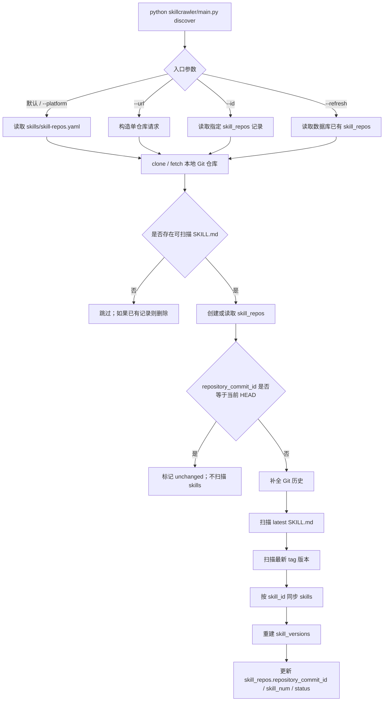
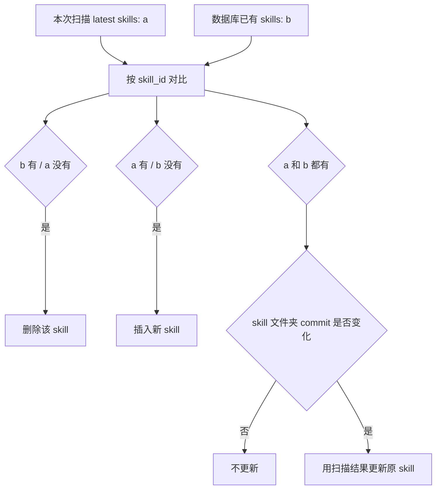

# skillcrawler

`skillcrawler` 是 WittyHub 的 Skill 仓库发现工具。它不是“全网爬虫”，而是面向一组明确的 Git 仓库，完成注册、clone/fetch、扫描 `SKILL.md`、分类和入库。

## 1. 职责边界

`skillcrawler` 负责：

1. 从 `skills/skill-repos.yaml` 或命令行参数接收 Git 仓库地址
2. clone / fetch 仓库到本地工作目录
3. 扫描仓库中的可用 `SKILL.md`
4. 必要时创建或更新 `skill_repos` 记录
5. 解析 frontmatter 和正文内容
6. 生成 latest skill 与 tag version 记录
7. 为 skill 分类 `category`
8. 同步写入 `skills` / `skill_versions` 表

核心入口：

```text
skillcrawler/main.py
```

模块结构：

```text
skillcrawler/
├── main.py                     # CLI 入口：query / discover / delete
├── config.py                   # 仓库列表配置加载：默认 skills/skill-repos.yaml
└── core/
    ├── category_classifier.py  # AI 分类
    ├── git_operations.py       # Git clone/fetch/tag/commit/认证
    ├── openeuler_sig.py        # openEuler SIG 映射加载
    ├── skill_parser.py         # frontmatter 解析、skill_id 生成、URL 构建
    ├── skill_scanner.py        # 扫描 SKILL.md 并构造 SkillVersion
    └── skill_manager.py        # discover 编排层

src/models/
└── repository.py               # skill_repos / skills / skill_versions 数据库操作
```

---

## 2. 数据模型约定

### `skill_repos`

`skill_repos` 记录一个 Git 仓库的 discover 状态。

关键字段：

| 字段 | 含义 |
|------|------|
| `repo_name` | 由仓库 URL 生成的本地唯一名称，如 `gitcode.com_openeuler_wittyhub-cli` |
| `source` | 仓库来源，如 `gitcode` / `github` |
| `platform` | 平台分类，如 `openeuler` / `enterprise` / `personal` |
| `branch` | 当前扫描分支 |
| `url` | Git 仓库 URL |
| `local_path` | 本地 clone 绝对路径 |
| `repository_commit_id` | 仓库 HEAD commit，用于判断 repo 是否更新 |
| `skill_discover_status` | `init` / `discovering` / `done` / `failed` |
| `skill_num` | 当前 repo 下 latest skill 数量 |

### `skills`

`skills` 保存前端展示和下载时使用的 latest skill。

关键约定：

| 字段 | 含义 |
|------|------|
| `skill_id` | 全局唯一 Skill ID，格式类似 `gitcode/openeuler/wittyhub-cli/skills/find-skills` |
| `skill_repo_id` | 所属 `skill_repos.id` |
| `commit_id` | `SKILL.md` 所在 skill 文件夹的最新 commit，不是 repo HEAD |
| `platform` | 优先继承 `skill_repos.platform` |
| `author` | 普通仓库来自仓库 owner；openEuler 仓库来自 SIG 名称 |
| `extra_metadata.skill_directory_commit_id` | 与 `skills.commit_id` 相同，作为元数据保留 |

注意：repo HEAD commit 存在 `skill_repos.repository_commit_id`，不要写入 `skills.extra_metadata.repository_commit_id`。

### `skill_versions`

`skill_versions` 保存 tag 扫描得到的版本快照。每次扫描会重建当前 repo 的版本快照。

---

## 3. CLI 命令

入口文件：

```bash
python skillcrawler/main.py <command>
```

当前命令：

| 命令 | 用途 |
|------|------|
| `query` | 查询 `skill_repos` 记录 |
| `discover` | 注册、clone/fetch、扫描并同步 Skill |
| `delete` | 删除 `skill_repos` 记录及本地 clone |

### query

查询所有 skill repo：

```bash
python skillcrawler/main.py query
```

按 id 查询：

```bash
python skillcrawler/main.py query --id <repo_id>
```

支持参数：

- `-i` / `--id`：查询单个 skill repo

### discover

`discover` 是唯一扫描入口。

支持参数：

| 参数 | 说明 |
|------|------|
| `-p` / `--platform` | 选择 `openeuler` / `enterprise` / `personal` 仓库列表；不传时读取全部列表 |
| `-c` / `--config` | 临时指定仓库列表 YAML；默认 `skills/skill-repos.yaml` |
| `-u` / `--url` | 扫描单个仓库 URL，不依赖配置列表 |
| `-b` / `--branch` | 与 `--url` 搭配使用，指定分支 |
| `-i` / `--id` | 重新 discover 指定数据库仓库记录 |
| `-r` / `--refresh` | 刷新数据库中已有的 `skill_repos`，不读取配置列表 |
| `-f` / `--force` | 仅用于已有 repo 场景：即使状态是 `discovering` 也允许重跑；不会跳过 commit unchanged 优化 |

默认扫描全部配置列表：

```bash
python skillcrawler/main.py discover
```

扫描指定平台配置列表：

```bash
python skillcrawler/main.py discover --platform openeuler
python skillcrawler/main.py discover --platform enterprise
python skillcrawler/main.py discover --platform personal
```

扫描单个仓库：

```bash
python skillcrawler/main.py discover --url https://gitcode.com/openeuler/wittyhub-cli
```

单个 URL 平台识别规则：

- `https://gitcode.com/openeuler/<repo>` 会自动识别为 `platform=openeuler`
- 如果显式传入 `--platform`，以显式参数为准

扫描单个仓库指定分支：

```bash
python skillcrawler/main.py discover --url https://gitcode.com/openeuler/wittyhub-cli --branch master
```

按 id 重扫已有 repo：

```bash
python skillcrawler/main.py discover --id <repo_id>
```

刷新数据库已有 repo：

```bash
python skillcrawler/main.py discover --refresh
python skillcrawler/main.py discover --refresh --platform personal
```

### delete

删除仓库记录和本地 clone：

```bash
python skillcrawler/main.py delete --id <repo_id>
```

支持参数：

- `-i` / `--id`：必填，指定要删除的 skill repo

---

## 4. 仓库列表配置

默认仓库列表文件：

```text
skills/skill-repos.yaml
```

示例：

```yaml
openeuler_repos:
  - url: https://gitcode.com/openeuler/IB_Robot
  - url: https://gitcode.com/openeuler/PilotGo-plugin-llmops

personal_repos: []

enterprise_repos:
  - url: https://github.com/huggingface/diffusers
  - url: https://github.com/kotlin/kotlin-agent-skills
```

平台映射：

| 配置 key | 写入 platform |
|----------|---------------|
| `openeuler_repos` | `openeuler` |
| `personal_repos` | `personal` |
| `enterprise_repos` | `enterprise` |

---

## 5. discover 流程



核心行为：

- clone 目录不存在时执行 `git clone`
- clone 目录存在且是 Git 仓库时执行 `git fetch` / `checkout`
- 本地目录存在但不是 Git 仓库时，删除后重新 clone
- 扫描前会尝试补全 Git 历史，用于准确获取 skill 文件夹最新 commit
- 如果 `skill_repos.repository_commit_id` 与当前 HEAD 一致，则跳过 SKILL.md 分析
- 如果 repo HEAD 变化，则重新扫描并同步 skills

---

## 6. SKILL.md 发现规则

递归扫描仓库中所有名为 `SKILL.md` 的文件，但以下目录会跳过：

| 跳过目录 | 说明 |
|----------|------|
| `template` / `templates` | 模板 |
| `example` / `examples` | 示例 |
| `demo` / `demos` | 演示 |
| `test` / `tests` | 测试 |
| `fixture` / `fixtures` | 测试数据 |
| `doc` / `docs` | 文档 |
| `archive` / `archives` / `legacy` | 归档 |

示例：

```text
skills/find-skills/SKILL.md                    -> 识别
cve-fix-skill/cve-fix/SKILL.md                 -> 识别
migration/application-migration/.../SKILL.md   -> 识别
templates/skills/demo/SKILL.md                 -> 跳过
tests/skills/my-skill/SKILL.md                 -> 跳过
```

---

## 7. Skill 解析与 commit 规则

`SKILL.md` 支持 YAML frontmatter：

```markdown
---
name: find-skills
description: 搜索和发现 agent skills
category: developer-tools
tags: [search, discovery]
---

正文内容...
```

解析生成的字段：

| 字段 | 来源 |
|------|------|
| `skill_id` | 仓库来源 + owner/repo + `SKILL.md` 相对目录，不依赖 frontmatter |
| `name` | frontmatter `name`；缺失时用目录名 |
| `description` | frontmatter `description` |
| `category` | 已有数据库分类优先；否则 frontmatter；再否则调用分类模型 |
| `tags` | frontmatter `tags` |
| `content` | 去掉 frontmatter 后的正文 |
| `version` | latest 或 git tag |
| `commit_id` | `SKILL.md` 所在文件夹的最新 commit |
| `source_url` | 指向对应 ref 下的 `SKILL.md` URL |
| `platform` | 优先使用所属 `skill_repos.platform` |
| `author` | 普通仓库 owner；openEuler 仓库 SIG 名 |

commit 示例：

```bash
git log -1 --format=%H HEAD -- skills/find-skills
```

对于 `https://gitcode.com/openeuler/wittyhub-cli`：

```text
repo HEAD commit
  -> 写入 skill_repos.repository_commit_id

skills/find-skills 目录最新 commit
  -> 写入 skills.commit_id
```

---

## 8. 写入策略

`skills` 表不是整仓删除再插入，而是按 `skill_id` 做集合同步。



具体规则：

1. `b` 有、`a` 没有：从 `skills` 表删除
2. `a` 有、`b` 没有：插入新 skill
3. `a` 和 `b` 都有：比较 `skills.commit_id`
4. commit 相同：保持原记录不变
5. commit 不同：用本次扫描结果更新原记录，并保留原 `download_count`

`skill_versions` 表保存 tag 快照，每次扫描会删除该 repo 的旧版本快照并插入本次扫描得到的 tag skills。

---

## 9. openEuler SIG 规则

扫描 openEuler 仓库时，会把 SIG 名写入 Skill 的 `author` 字段。

流程：

```mermaid
flowchart TD
    A[platform=openeuler] --> B[加载 openEuler community 仓库缓存]
    B --> C[扫描 sig/*/sig-info.yaml]
    C --> D[读取 repositories[].repo]
    D --> E[只保留 openeuler/<repo>]
    E --> F[转换为 repo_name]
    F --> G[repo_name -> sig_name]
    G --> H[写入 skills.author]
```

说明：

- community 仓库缓存目录：`/opt/wittyhub/openeuler-community`
- 只读取 `openeuler/<repo>`
- 不读取 `src-openeuler/<repo>`
- 映射示例：`openeuler/PilotGo-plugin-llmops` -> `gitcode.com_openeuler_PilotGo-plugin-llmops` -> `sig_name`

---

## 10. 本地存储

默认本地存储来自 `config.yaml`：

```yaml
storage:
  local_path: /opt/wittyhub/
```

仓库 clone 路径：

```text
/opt/wittyhub/skill-repositories/<repo_name>
```

示例：

```text
/opt/wittyhub/skill-repositories/gitcode.com_openeuler_wittyhub-cli
```

日志路径：

```text
/opt/wittyhub/logs/skillcrawler.log
```

---

## 11. 推荐使用方式

推荐从项目根目录执行：

```bash
cd wittyhub
python skillcrawler/main.py query
python skillcrawler/main.py discover
```

也支持从 `skillcrawler/` 目录执行：

```bash
cd wittyhub/skillcrawler
python main.py query
python main.py discover
```

查看帮助：

```bash
python skillcrawler/main.py --help
python skillcrawler/main.py query --help
python skillcrawler/main.py discover --help
python skillcrawler/main.py delete --help
```
